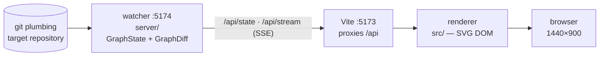

# Running the git visualiser against DrinkSmart

Live, read-only view of this repository's graph: commits, branches, HEAD, worktrees, and which agent
owns which worktree. Useful during a delegation wave — the `integration` branch appears, worktree
branches merge into it, `main` fast-forwards, the branch vanishes.

The tool lives in `/home/oscar/git_visual_system`. It only ever reads this repository.

Every symptom below was hit for real while building and checking the tool. Each is written as *what
you see* first, because that is what you will have when something goes wrong.

## Start it

One command, from `/home/oscar/git_visual_system` — **never from a worktree**:

```bash
cd /home/oscar/git_visual_system
tools/watch-repo /home/oscar/DrinkSmart          # add --force to replace what is running
```

Open **http://localhost:5173**.

It starts both halves, reports how many worktrees it actually attributed, and logs to `.gvs/`:

```
watch-repo: watching /home/oscar/DrinkSmart
watch-repo: ownership OK, 5/5 worktrees attributed
watch-repo: stop with  kill $(cat /home/oscar/git_visual_system/.gvs/*.pid)
```

**Use this rather than starting the two servers by hand.** It exists because of two failures that are
invisible when you hit them:

1. **Started in a terminal, both halves die with the session that launched them.** `npm run serve` and
   `vite` run in that terminal's foreground process group, so they take `SIGHUP` when it closes — or
   when the agent session that ran them ends. `watch-repo` `setsid`s them into their own session.
   Confirm with `ps -o tty= -p $(cat .gvs/watcher.pid)`: a `?` means detached.
2. **Started by hand, the watcher cannot see agent ownership at all.** `traycer agent list` reads
   `TRAYCER_EPIC_ID` and `TRAYCER_AGENT_ID` from the environment — there are no flags for either — and
   npm rewrites `PATH` so the CLI may not even resolve. `watch-repo` captures both and **refuses to
   start** rather than silently draw every worktree as unowned.

Point it at any repository by changing the path argument.

### Confirm it actually came up

```bash
curl -sf -o /dev/null -w "watcher %{http_code}\n" localhost:5174/api/state
curl -sf -o /dev/null -w "vite    %{http_code}\n" localhost:5173/
curl -sf -o /dev/null -w "proxy   %{http_code}\n" localhost:5173/api/state   # must also be 200
```

All three `200`, and the watcher should agree with git:

```bash
curl -s localhost:5174/api/state | head -c 300
git -C /home/oscar/DrinkSmart rev-parse --short main    # should match what the watcher reports
```

**Check liveness, not the lock.** `tools/agent-lock` holds a `flock` on a file descriptor the kernel
releases when the process ends, including on `SIGKILL`, so a stale lock is not a failure mode that
exists. The lock file remaining on disk is not the lock. The real risk is the opposite: if a server
dies the lock frees silently and nothing announces it.

## Shape



Neither half is useful alone. The watcher has no UI; the renderer never touches git. A renderer with a
dead `/api/stream` is only exercising its own reconnect path, which looks like it is working.

They differ in one way that matters when you change code:

|  | Picks up edits |
| --- | --- |
| **Renderer** (Vite, `src/`) | Instantly, via HMR. No restart. |
| **Watcher** (`tsx server/index.ts`) | **Never.** It loaded its modules at startup and runs them until killed. |

Two further reasons for the shape: `watcher` and `dev-server` are **separate lock scopes** because one
`flock` is exclusive, and sharing a scope makes the second server exit 75 instead of starting; and Vite
serves whichever tree it was started from, so starting it in a worktree while editing the root
produces a stale page and a green result that means nothing.

## Troubleshooting

### The whole page is blank, or the worktree cards vanished

**Most likely: you changed `shared/types.ts` and only the renderer noticed.** The renderer hot-reloads
and starts reading the new field; the watcher keeps emitting the old one. The field arrives
`undefined`, the layer renders nothing, and **no error appears anywhere** — empty array, empty screen,
HTTP 200.

**After any `shared/types.ts` change, restart the watcher.** The renderer handles itself.

```bash
cd /home/oscar/git_visual_system
tools/watch-repo /home/oscar/DrinkSmart --force
```

`--force` stops whatever holds the ports first. Prefer it to `pkill -f "server/index.ts"`, which
matches more broadly than you expect and will take out a second watcher pointed at another repo.

### The graph never updates — commits land in git but nothing moves

The watcher tracks the target `.git` with `fs.watch(gitDir, { recursive: true })`, which binds to an
**inode**. If that directory was deleted and recreated — exactly what a scratch-repo reseed script
does — the handle is dead. Linux signals this as `IN_IGNORED`, **not** an error, so the error handler
never fires and nothing is logged. `/api/state` keeps answering `200` with frozen state naming commits
that no longer exist.

**Restart the watcher after anything recreates the target's `.git`.** Then confirm it agrees with
`git rev-parse --short main` before trusting what you see.

### Every worktree says "unowned"

**First: is there a red banner top-left?** That is the whole diagnosis.

| | Means |
| --- | --- |
| **No banner**, cards read "unowned worktree" | The lookup worked. Nobody *is* working there. |
| **Banner**, cards dashed red, "ownership unknown" | The lookup failed. The graph is still correct; only ownership is missing. |

The banner names the error and when a lookup last succeeded. The two commonest:

- `TRAYCER_EPIC_ID and TRAYCER_AGENT_ID not set` — the watcher was started without a Traycer identity
  and can never attribute anything. Restart it with `tools/watch-repo`.
- A non-zero exit or `ENOENT` — `traycer` itself is unreachable. Ownership is re-polled every 15s and
  recovers on its own; the banner clears without a restart.

`traycer agent list` is measured at **1.7–2.0s idle and 10.0s under load** — and load is precisely when
you are watching — so it is cached, refreshed in the background, and never on the critical path of a
state build. On failure the last known names are retained and the card is dashed: they were true
recently and may be stale, which is worth more than blanking them.

Confirm from the state directly:

```bash
curl -s localhost:5174/api/state | python3 -c "import json,sys; print(json.load(sys.stdin)['ownership'])"
# {'ok': True, 'error': None, 'lastSuccessAt': 1786461933761}
```

**Before 2026-08-11 this failure was silent** — a `console.warn` and five confident "unowned" cards,
indistinguishable from a real answer. A watcher showing no banner and no `ownership` key in
`/api/state` is running pre-fix code. Restart it.

Note that a worktree's **directory name and branch name can differ**, which reads as a mismatch rather
than a fault: `traycer-w1b-vessel-meter` carried the branch `traycer/visual-check` for a while. Traycer
cards name the directory; the graph names the branch.

### Only old commits are visible, no branch labels, no HEAD

The canvas is as wide as the whole history — 23,762px for a 200-commit repository against a 1440px
viewport — and grows rightwards. Everything interesting is at the right-hand tip.

The view follows the tip automatically, **but only while you are already near it**, so scrolling back
to inspect history is not yanked forward by the next commit. **Scroll right to resume following.**

### A server refuses to start, exit 75

```
Another job already holds /tmp/git-visual-system.<scope>.lock; wait for it to finish.
```

Something already holds that scope. If nothing should be, find and kill it:

```bash
pkill -f "tsx server/index.ts"   # watcher
pkill -f vite                    # renderer
```

### A server refuses to start, exit 64

```
Unknown lock scope: <name>
Scopes: dependencies, dev-server, watcher, supabase, benchmark, resource-heavy
```

Typo in the scope name. The two you want are `watcher` and `dev-server`.

### The page loads but shows stale content, and your edits do nothing

Vite serves **whichever tree it was started from**. Started inside a worktree while you edit the root
checkout, it will happily serve the worktree's copy — and any test run from that directory reports
green against code you did not change. Start it from `/home/oscar/git_visual_system`.

### Several `npm run dev` instances are running

Running it repeatedly does not fail — Vite increments to the next free port. The failure mode is not a
crash but several redundant servers on unpredictable ports serving near-identical files, and you
looking at the wrong one. One server, one port, one lifecycle.

### Labels overlap, or something is cut off at the edge

Report it rather than working around it. Branch labels, HEAD labels and the viewBox all have collision
and extent handling, and every combination is asserted in the visual-check archive at
`docs/visual/screenshots/`. An overlap is a regression, not a quirk.

## Reading the picture

| What you see | Means |
| --- | --- |
| Dark circle | Ordinary commit |
| **Maroon circle** | **Merge commit** — two parents |
| Teal rounded rect | Local branch label |
| Teal, dashed + *italic* | Remote branch (`origin/main`) |
| Crimson rect, "HEAD" | HEAD attached — arrow points at a **branch** |
| Crimson, dashed, "HEAD · detached" | Detached HEAD — arrow points at a **commit** |
| Purple card | A directory and every agent working in it |
| **Purple card, dashed red** | **Ownership could not be determined** — names may be stale |
| Red banner, top-left | Ownership lookup is failing; the error and last good lookup |
| Pill, bottom-right | Stream state — teal `Live`, red `lost` |

**Merge commits and HEAD labels share the same palette** (`#881337` / `#fb7185`) and are told apart
only by shape — circle versus rounded rectangle. That is the design as drawn in `reference/*.svg`,
verified hex-for-hex, but it is the one pairing that trips people up.

The purple cards list **every** agent operating in that directory, one per line, up to three, then a
count. A dedicated worktree normally has one; a primary checkout routinely has several — an
orchestrator, a relay hub, another session. Hover for the full list.

**Visual index:** `docs/visual/gvs-visual-index.html` draws every mark at the size and colour the
renderer actually uses. Open it in a browser. Hex values are the `--gvs-*` custom properties in
`src/style.css`, verified against `reference/*.svg`.
