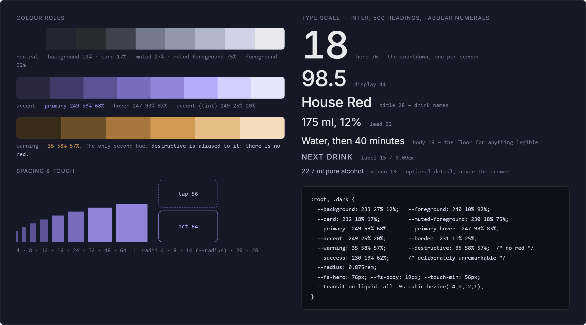
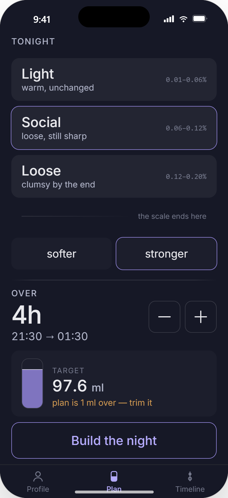
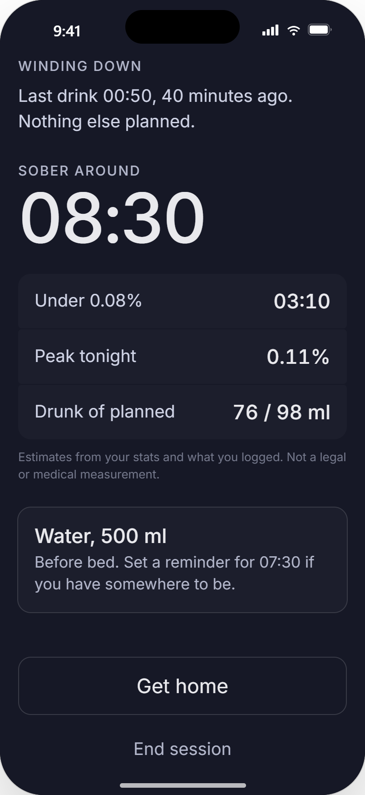
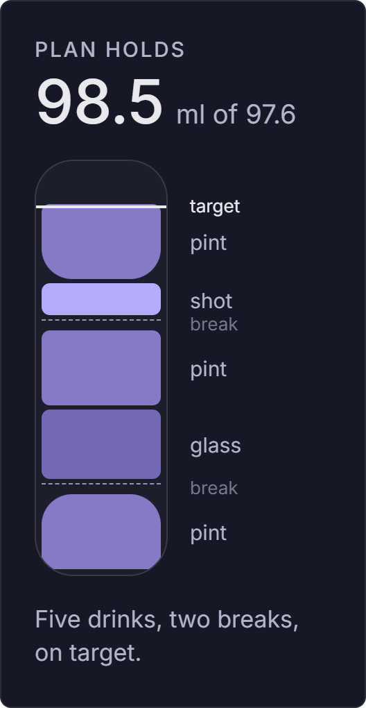
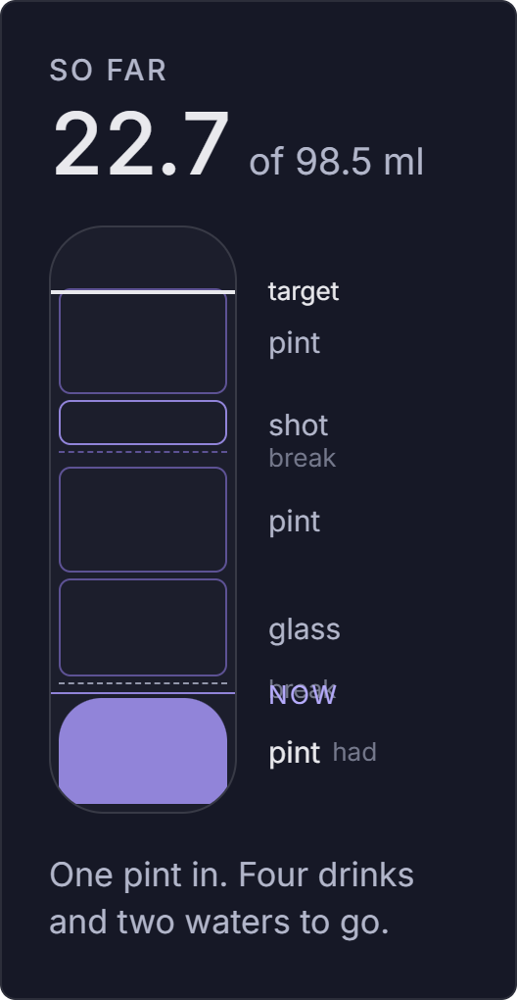
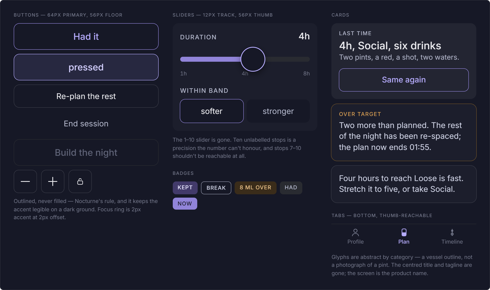

# Handoff: DrinkSmart — visual language, token layer, and three core screens

Target repo: `wedmoreoscar-blip/DrinkSmart`, branch `main`, source under `src/`
(React + TypeScript + Tailwind + shadcn/ui, Lovable-scaffolded).

## Overview

DrinkSmart plans a night's drinking to a chosen buzz level and paces the user through it.
This handoff replaces the stock Lovable visual layer with a purpose-built one, and redesigns
the three screens the product actually lives in: the buzz picker, the timeline, and the
notification. It also specifies two surfaces that do not exist in the repo yet — a
**wind-down** state and **water/break rows** — which need engine work, not just UI.

The governing constraint, from which everything else follows: *the app is a bar instrument,
not a screen*. One hand, one thumb, a dark loud room, and a user who is less sober every hour.

## How to use this (read this first, Claude Code)

You cannot render HTML. Everything you need is readable without rendering:

1. **Look at the PNGs in `screens/`** — one per screen, 2x, rendered from the prototype.
   These are the ground truth for what each screen looks like. Open them as images.
2. **Read the matching `screens/*.html`** — the exact markup for that screen, all styling
   inline and literal (no classes to resolve, no build step). Every hex, px, radius and
   font shorthand in the spec below appears verbatim in these files. Port them into React
   components; do not copy them in as HTML.
   `{{ someName }}` in those files are prototype data bindings — replace each with real
   React state (they are named for what they hold: `fillHeight`, `targetMl`, `durLabel`,
   `pickSocial`, …).
3. **Apply `tokens/` first** — those two files are real production code and are meant to
   replace `src/index.css` and `tailwind.config.ts` more or less as-is. Do this before
   touching components; every screen assumes them.
4. **Use this README for the rules the pixels don't state** — the 19px legibility floor,
   the 56/64px touch floors, no-red/no-green, what the engine can't currently express.

Suggested order of work: tokens → primitives (`src/components/ui/*`) → the bottom tab bar
and removal of the `Dashboard.tsx` header → 1c → 1d → 1g → the engine work → 1f.

`DrinkSmart-design-reference.html` is a single self-contained file for a **human** to open
in a browser (some screens are interactive). It is 1.3 MB of compiled output — do not read
or parse it; use `screens/` instead.

## About the design files

These are **design references created in HTML** — prototypes showing intended look and
behaviour, not production code to ship. Recreate them in the repo's existing environment
(React + TypeScript + Tailwind + shadcn/ui), using its established patterns and primitives.
The one exception is `tokens/`, which is production code.

Each design carries a visible id badge (`1a`–`1k`); those ids name the files in `screens/`
and the sections below.

## Fidelity

**High-fidelity.** Colours, type sizes, spacing, radii, touch targets, motion timings and
copy are all final and exact. Recreate pixel-faithfully using repo primitives. Every value
appearing in the mock exists as a token in `tokens/index.css` — reach for the token, not the
hex.

Screens are drawn at **402 × 874** (iPhone 16 Pro logical size). Layout is fluid; only the
fixed heights called out below (64px actions, 58px tab bar) are literal.

---

## Design tokens



Drop-in files in `tokens/`:

- `tokens/index.css` → replaces `src/index.css`
- `tokens/tailwind.config.ts` → replaces `tailwind.config.ts`

They keep the shadcn variable names and the repo's HSL-triplet convention, so
`bg-background`, `text-muted-foreground`, `border-border` etc. keep working — the values
behind them change. Read the comments in `index.css`; they carry the rationale.

### Colour

Dark only. **There is no light theme** — `.dark` is kept identical to `:root` so
`darkMode: ["class"]` cannot produce a broken state. A light mode in a dark bar is a flashbang.

| Role | HSL | Hex | Use |
| --- | --- | --- | --- |
| `--background` | `233 27% 12%` | `#161826` | app ground |
| `--card` | `232 18% 17%` | `#232532` | cards, notification |
| (raised row) | — | `#1c1e2c` | nudge buttons, timeline hero row, stat rows |
| `--secondary` | `225 9% 18%` | `#292b31` | dividers, tab-bar rule |
| `--border` / `--input` | `231 11% 25%` | `#383a46` | outlines on secondary controls |
| `--muted` | `227 10% 27%` | `#3f424d` | dead icon fills |
| (dim text) | — | `#75798c` | micro detail, inactive tab |
| `--success` | `230 13% 62%` | `#9397ab` | completed — deliberately unremarkable |
| `--muted-foreground` | `230 18% 75%` | `#b2b6ca` | secondary text — **the floor**; nothing legible is set thinner or dimmer |
| (bright body) | — | `#cfd3e5` | emphasised body |
| `--foreground` | `240 10% 92%` | `#e9e9ed` | primary text |
| `--primary` | `249 53% 68%` | `#9184d9` | the accent — a line, a level, a now-marker |
| `--primary-hover` | `247 93% 83%` | `#b5abfc` | accent text/labels on the dark ground |
| `--accent` | `249 25% 20%` | `#2b2741` | selected/hover tint |
| `--warning` | `35 58% 57%` | `#d29a51` | over target, too fast, too soon |
| `--destructive` | aliased to `--warning` | `#d29a51` | **there is no red in this app** |

Accent ramp for tints: `#2b2741 · #423a6a · #5d5294 · #796cbf · #9184d9 · #b5abfc · #d2cefd · #e7e5fe`.

Two rules that matter more than the values: **one accent, no palette**, and **no red, no
green**. Completion desaturates rather than celebrates. Nothing in this product congratulates
the user for drinking.

### Type

Inter throughout. Headings 500, never heavier; body 400. `letter-spacing: -0.015em` on
headings, `-0.03em` on the hero numeral. Every number the user reads at a glance is
`font-variant-numeric: tabular-nums` (the `.num` class).

| Token | Size / line-height | Use |
| --- | --- | --- |
| `--fs-hero` | 76 / 0.92 | the countdown, one per screen |
| `--fs-display` | 44 / 1.0 | target ml, duration |
| `--fs-title` | 28 / 1.15 | drink names |
| `--fs-lead` | 22 / 1.3 | drink detail |
| `--fs-body` | 19 / 1.45 | **floor for anything legible** |
| `--fs-label` | 15 / 1.2, `0.09em`, uppercase | section labels |
| `--fs-micro` | 13 / 1.4 | optional detail, never the answer |

The 19px floor is the single biggest departure from Nocturne (15px body, 0.70× density) and
is non-negotiable: 15px at arm's length, half-drunk, in a dark bar, is unreadable.

### Spacing, touch, radius, motion

- Spacing: `4 · 8 · 12 · 16 · 24 · 32 · 48 · 64` (`--sp-1`…`--sp-8`). Screen gutter 20px.
- Touch: `--touch-min: 56px` — **nothing tappable is smaller**. `--touch-primary: 64px` for
  the one primary action per screen.
- Radius: `4 · 8 · 14 (--radius) · 20 · 28`. Cards and actions 14; notification cards 20;
  chips 6.
- Elevation is an edge plus ambient darkness, never a stacked shadow:
  `--shadow-sm: 0 0 0 1px hsl(231 11% 25%)`,
  `--shadow-md: 0 0 0 1px hsl(227 10% 27%), 0 6px 18px hsl(233 27% 6% / .55)`,
  `--shadow-lg: 0 0 0 1px hsl(230 13% 62% / .5), 0 16px 40px hsl(233 27% 4% / .65)`.
- Motion: `--transition-smooth .28s`, `--transition-page .42s`, `--transition-liquid .9s`,
  all `cubic-bezier(.32,.72,0,1)` (liquid uses `.4,0,.2,1`). Slow on purpose. Nothing flashes,
  bounces, or celebrates.
- Focus is themed, never the browser default: `:focus-visible { outline: 2px solid hsl(var(--ring)); outline-offset: 2px }`.

### The fading rule

Borrowed from Nocturne and used as the timeline spine and every horizontal divider: a 1px
line that fades to transparent at both ends over 40–48px.

```css
background: linear-gradient(to right, transparent,
  rgba(233,233,237,.16) 48px,
  rgba(233,233,237,.16) calc(100% - 48px), transparent);
```

Vertical spine: same, `to bottom`, 30px fade.

---

## Chrome common to all screens

**No header.** The centred title and top tabs in `Dashboard.tsx` are removed — they cost a
third of the thumb-reachable area and say nothing.

**Bottom tab bar**, three tabs: Profile · Plan · Timeline. `min-height: 58px`, 1px
`#292b31` top rule, icon 22px + 13px label, 5px gap, column layout. Active tab is `#b5abfc`
with a 500-weight label and a filled icon; inactive is `#75798c`, 400 weight, outline icon.
Sits flush to the bottom; `padding-bottom: env(safe-area-inset-bottom)` on body.

---

## Screens

### 1c — Plan / buzz picker
Replaces the 1–10 slider in `src/components/tabs/PlanTab.tsx`.



Source: `screens/1c-buzz-picker.html`

**Purpose:** choose how drunk you intend to get, and over how long.

**The core change:** the 1–10 scale is gone from the UI. Three named bands:

| Band | maps to `buzzLevels` | subtitle | BAC range shown |
| --- | --- | --- | --- |
| Light | 1–2 | warm, unchanged | 0.01–0.06% |
| Social | 3–4 | loose, still sharp | 0.06–0.12% |
| Loose | 5–6 | clumsy by the end | 0.12–0.20% |

Levels **7–10 are unreachable in the UI**. The consequence: the danger warning has nothing
to warn about, so it is deleted. Below the three cards sits a fading rule with the text
*"the scale ends here"* (13px, `#75798c`) — the scale visibly stops rather than silently
truncating.

**Layout**, top to bottom, 20px gutter, 64px top padding:

1. Label `TONIGHT` (15/0.09em uppercase, `#b2b6ca`), 20px below.
2. Three band cards, 10px gap. Each: `min-height 72px`, padding `14px 18px`, `#232532`,
   radius 14, row with name (500/24) + subtitle (400/15 `#b2b6ca`) on the left, BAC range on
   the right (13px mono, `#75798c`, tabular). Selected state: `box-shadow: 0 0 0 2px #9184d9`
   — a ring, no fill, no colour change.
3. `softer` / `stronger` nudge pair — two 56px buttons, flex 1, 12 radius, `#1c1e2c`,
   19px label. These select the lower/upper level *within* the chosen band. Selected: same
   accent ring. Default is the lower level of the band with neither nudge active.
4. Fading rule, 18px above / 14px below.
5. Duration block: label `OVER`, value at 44px display (`4 h 00`), and `21:30 → 01:30` at
   19px `#b2b6ca` below. Right side: two 56×56 stepper buttons (− and +, 1px `#383a46`,
   radius 12), 30-minute increments. Range 1 h – 8 h.
6. Pushed to the bottom (`margin-top:auto`): the target card — `#1c1e2c`, radius 14,
   padding `14px 18px`. Left: the vertical vessel meter, 38 × 88, 1px `#383a46`, radius 12,
   accent fill rising from the bottom at 85% opacity, animating over `--transition-liquid`,
   with a 1px `#e9e9ed` target line at 78% height. Right: `TARGET` micro label, the ml figure
   at 28px with a 19px `ml` suffix in `#b2b6ca`, and a one-line note whose colour is
   `#b2b6ca` normally and `#d29a51` when the plan runs over target.
7. Primary action: `Build the night` — 64px, 1px `#9184d9` outline, radius 14, label
   500/22 in `#b5abfc`. **Outlined, never filled.**
8. Tab bar.

**Interactions:** tapping a band sets the level and recomputes target ml and fill height;
softer/stronger shifts within the band; the steppers change duration and the end clock. All
value changes animate the fill over 900ms. No haptics spec'd; add the platform default light
impact on band selection if cheap.

### 1d — Timeline (recommended)
Replaces `src/components/tabs/TimelineTab.tsx` + `SortableTimelineItem.tsx`.


Source: `screens/1d-timeline.html`

**Purpose:** what's next, how long until it, and what the rest of the night looks like.

**Structure:** a fixed hero pinned to the top and a scrolling spine below it. The hero never
scrolls away — it is the answer to the only question the user has.

**Hero** (padding `8px 20px 20px`, 1px `#292b31` bottom rule):
- Row: `NEXT` (15/0.09em uppercase, `#b5abfc`) left, `now 22:12` (15px `#b2b6ca`, tabular) right.
- Row: drink name 500/30 and `175 ml glass · 22:30` at 22px `#b2b6ca`, left; the countdown
  numeral at 76/0.92 with `MIN AWAY` beneath it, right.
- Actions, 10px gap: `Had it` — flex 1, 64px, accent outline, `#b5abfc` 500/22; `+15` —
  104 × 64, 1px `#383a46`, 19px. Two actions, always the same two, always in the same places.

**Spine** (scrollable, `padding: 18px 20px 8px`, hidden scrollbar): a 1px fading vertical
rule at x = 97px. Each row is `[62px time] [34px marker] [flex content]`.

Row types:

| Type | Marker | Text |
| --- | --- | --- |
| Past drink | 11px solid `#75798c` dot, whole row at `opacity .45` | name 22px, `pint · had` 15px |
| Water / break | 13px dot, 1px **dashed** `#9397ab`, hollow (`#161826` fill) | `Water` in `#cfd3e5`, `330 ml · 20 min break` |
| Now marker | — | `now` label in `#b5abfc` + a 1px rule fading accent → transparent |
| Next drink (hero row) | 15px solid `#9184d9` with `0 0 0 5px rgba(145,132,217,.22)` halo | raised card: `#1c1e2c`, radius 14, `0 0 0 1px #9184d9`, margin `0 -6px 10px`; name 500/25, `175 ml glass, 12%` 19px, `21.0 ml · 21% of target` 13px `#75798c` |
| Future drink | 13px, 1.5px `#5d5294` outline, hollow | name 22px, detail 15px; optional 44px trailing lock button |
| Locked ("kept") | 13px, 1.5px **`#9184d9`** outline, hollow | name + `kept` chip (11px/0.06em uppercase, `#423a6a` bg, `#e7e5fe` text, radius 6), detail `25 ml shot · stays if you re-plan`; filled padlock glyph in accent |
| Plan end | 23px horizontal dash | `Plan ends`, `sober around 08:30` 15px `#75798c` |

Footer of the spine: `Add a drink` and `Re-plan the rest` — two flex-1 buttons, 56px, 1px
`#383a46`, radius 14, 19px.

**Copy rule:** unplanned additions and locked drinks read as *adjustment*, never breakage.
Never "you've gone off plan".

### 1e — Timeline, alternate layout (proportional time axis)
Same content, but rows are absolutely positioned so vertical distance is proportional to
elapsed time — pacing becomes the shape of the screen. Hero is compressed (60px numeral,
no card), actions move to a fixed footer above the tab bar. Spine at x = 76px, rows
`[56px time] [20px marker] [content]`.


Source: `screens/1e-timeline-time-axis.html`

Worth building only if you can guarantee the whole night fits without scrolling; otherwise
ship **1d**. Treat this as an option, not a requirement.

### 1f — Wind-down (new — needs engine work)
Does not exist in the repo. Entered when the last planned drink has been logged, or the plan
end time has passed.



Source: `screens/1f-wind-down.html`

**Purpose:** close the session honestly. No score, no streak, no praise.

- `WINDING DOWN` label; one line of context: *"Last drink 00:50, 40 minutes ago. Nothing else planned."*
- `SOBER AROUND` + the time at 76px hero. Elimination assumed at **0.015 %/h**.
- Three stat rows, 1px gaps, `#1c1e2c`, 60px min-height, padding `0 18px`, radii cornered
  as a group (`14 14 4 4` / `4` / `4 4 14 14`): `Under 0.08%` → `03:10`; `Peak tonight` →
  `0.11%`; `Drunk of planned` → `76 / 98 ml`. Label 19px `#cfd3e5`, value 500/22 tabular.
- Disclaimer, 13px `#75798c`: *"Estimates from your stats and what you logged. Not a legal or medical measurement."* — required, keep the wording.
- One care card: `Water, 500 ml` (500/22) + *"Before bed. Set a reminder for 07:30 if you have somewhere to be."*
- Bottom: `Get home` (64px, `#383a46` outline) and `End session` (56px, text-only, `#b2b6ca`).

Nothing here says the user did well. That is the design.

### 1g — Notification (design this as a screen, it is the real interface)
Most of the product happens on the lock screen. `useNotifications.ts` /
`useWebDrinkReminders.ts` should produce exactly this.


Source: `screens/1g-notification.html`

- One notification per drink, fired at the scheduled time.
- Card: `#232532`, radius 20, `0 0 0 1px #383a46`. App row: 22px accent square + `DRINKSMART`
  (13px/0.08em uppercase `#b2b6ca`) + relative time right.
- Title `House Red, 175 ml` (500/28); body `Due 22:30. Second of five.` (19px `#cfd3e5`).
- Action row divided by a 1px rule: **`Had it`** (`#b5abfc`, 500/19) and **`+15 min`**
  (`#e9e9ed`, 400/19), each 60px min-height, split 50/50 by a 1px vertical rule.
- Break notifications are the quieter variant: `#1c1e2c`, `opacity .75`, no actions —
  `Water, 330 ml` / `Break until 22:30.`

**The rule:** the same two actions, in the same two places, every time, all night. A drunk
thumb should not have to read. Both actions must work without opening the app.

### 1h / 1i / 1j — Pure-alcohol meter
Replaces the battery meter at `src/components/tabs/DrinksTab.tsx:878–990`. A vertical vessel,
never a battery, never a progress bar. Three forms of the same object — pick one and use it
everywhere:





Source: `screens/1h-meter-continuous.html`, `1i-meter-segmented.html`, `1j-meter-mid-session.html`

- **1h Continuous** — one rising level, one 1px target line. Over-target fill reads above
  the line in `#d29a51`. Simplest; recommended.
- **1i Segmented** — one block per drink, breaks as gaps. Countable at a glance; a block is
  tappable to see the drink.
- **1j Mid-session** — drunk-so-far solid, still-planned hollow, a now-line across. This is
  the form to use inside the Timeline.

All three: 1px `#383a46` container, radius 12, accent fill at 85% opacity, filling animated
with `--transition-liquid` (900ms). Numbers alongside are tabular; the ml figure is the
answer, the percentage is micro detail.

### 1k — Primitives
Buttons, cards, slider, tabs, badges and meter at the sizes the app actually uses them.
Map onto the existing `src/components/ui/*` shadcn primitives — restyle those, don't fork:



Source: `screens/1k-primitives.html`

- **Primary button** — 64px, accent 1px outline on transparent, radius 14, 500/22 `#b5abfc`. Never a solid fill.
- **Secondary button** — 56px, 1px `#383a46`, 400/19 `#e9e9ed`.
- **Card** — `#232532` (or `#1c1e2c` raised), radius 14, no shadow; selection is a 2px accent ring.
- **Badge / chip** — 11px/0.06em uppercase, `#423a6a` on `#e7e5fe`, radius 6, padding `5px 8px`.
- **Tabs** — the bottom bar described above; the shadcn top-tabs pattern is not used.

---

## State & engine work required

Three things the current engine cannot express. These are backend/logic tasks, not styling:

1. **Breaks and water entries.** The engine assumes every timeline entry carries ethanol; a
   0% ABV / 0 ml-alcohol row cannot be represented. The break row is driven by **duration,
   not ethanol** — it needs its own entry type with a duration, an optional volume, and no
   BAC contribution.
2. **Wind-down state.** A session needs a terminal state with a sober-by estimate
   (0.015 %/h elimination), a time-under-0.08% figure, a peak BAC, and drunk-vs-planned totals.
3. **Locking + regeneration.** Individual drinks must be lockable (`kept`) and the remainder
   of the plan regenerated around them when the user re-plans, adds an unplanned drink, or
   pushes one back by 15 minutes.

UI state per screen: selected band + nudge, session duration and start time (Plan); logged
entries, current time, locked ids, scroll position (Timeline); session phase (planning /
active / winding down).

## Assumptions — please challenge these

- Band → level mapping (Light 1–2 / Social 3–4 / Loose 5–6) and the removal of 7–10.
- Demo profile: 82 kg, 180 cm, 28, male; 4 h session from 21:30. Watson TBW, UK units
  (568 ml pint, 175 ml glass, 25 ml shot, £).
- Elimination 0.015 %/h for the sober-by estimate.

## Not designed yet

Profile / onboarding (`StatsForm`, `PreferencesPicker`), drink picker and menu scanner,
establishment browsing, auth. They follow the same tokens — ask and they'll be drawn.

## Files in this bundle

| File | What it is |
| --- | --- |
| `README.md` | This file — the spec. Self-sufficient. |
| `screens/*.png` | Rendered image of each design, 2x. Look at these. |
| `screens/*.html` | Exact inline-styled markup for each design. Port, don't paste. |
| `tokens/index.css` | Production drop-in for `src/index.css` |
| `tokens/tailwind.config.ts` | Production drop-in for `tailwind.config.ts` |
| `DrinkSmart-design-reference.html` | The full interactive design doc, for a human in a browser. Do not parse. |
