# Handoff: DrinkSmart — visual language, token layer, and three core screens

Target repo: `wedmoreoscar-blip/DrinkSmart`, branch `main`, source under `src/`
(React + TypeScript + Tailwind + shadcn/ui, Lovable-scaffolded).

## Overview

DrinkSmart plans a night's drinking to a chosen buzz level and paces the user through it.
This handoff replaces the stock Lovable visual layer with a purpose-built one, and redesigns
the three screens the product actually lives in: the buzz picker, the timeline, and the
notification. It also specifies two surfaces that do not exist in the repo yet — a
**wind-down** state and **water/break rows** — which need engine work, not just UI.

The governing constraint, from which everything else follows: *the app is a bar instrument,
not a screen*. One hand, one thumb, a dark loud room, and a user who is less sober every hour.

## How to use this (read this first, Claude Code)

You cannot render HTML. Everything you need is readable without rendering:

1. **Look at the PNGs in `screens/`** — one per screen, 2x, rendered from the prototype.
   These are the ground truth for what each screen looks like. Open them as images.
2. **Read the matching `screens/*.html`** — the exact markup for that screen, all styling
   inline and literal (no classes to resolve, no build step). Every hex, px, radius and
   font shorthand in the spec below appears verbatim in these files. Port them into React
   components; do not copy them in as HTML.
   `{{ someName }}` in those files are prototype data bindings — replace each with real
   React state (they are named for what they hold: `fillHeight`, `targetMl`, `durLabel`,
   `pickSocial`, …).
3. **Apply `tokens/` first** — those two files are real production code and are meant to
   replace `src/index.css` and `tailwind.config.ts` more or less as-is. Do this before
   touching components; every screen assumes them.
4. **Use this README for the rules the pixels don't state** — the 19px legibility floor,
   the 56/64px touch floors, no-red/no-green, what the engine can't currently express.

Suggested order of work: tokens → primitives, 1l then 1m (`src/components/ui/*`) → the bottom tab bar → the bottom tab bar
and removal of the `Dashboard.tsx` header → 1n/1o → 1d → 1g → the engine work → 1f.

`DrinkSmart-design-reference.html` is a single self-contained file for a **human** to open
in a browser (some screens are interactive). It is 1.3 MB of compiled output — do not read
or parse it; use `screens/` instead.

## About the design files

These are **design references created in HTML** — prototypes showing intended look and
behaviour, not production code to ship. Recreate them in the repo's existing environment
(React + TypeScript + Tailwind + shadcn/ui), using its established patterns and primitives.
The one exception is `tokens/`, which is production code.

Each design carries a visible id badge (`1a`–`1k`); those ids name the files in `screens/`
and the sections below.

## Fidelity

**High-fidelity.** Colours, type sizes, spacing, radii, touch targets, motion timings and
copy are all final and exact. Recreate pixel-faithfully using repo primitives. Every value
appearing in the mock exists as a token in `tokens/index.css` — reach for the token, not the
hex.

Screens are drawn at **402 × 874** (iPhone 16 Pro logical size). Layout is fluid; only the
fixed heights called out below (64px actions, 58px tab bar) are literal.

---

## Design tokens


Drop-in files in `tokens/`:

- `tokens/index.css` → replaces `src/index.css`
- `tokens/tailwind.config.ts` → replaces `tailwind.config.ts`

They keep the shadcn variable names and the repo's HSL-triplet convention, so
`bg-background`, `text-muted-foreground`, `border-border` etc. keep working — the values
behind them change. Read the comments in `index.css`; they carry the rationale.

### Colour

Dark only. **There is no light theme** — `.dark` is kept identical to `:root` so
`darkMode: ["class"]` cannot produce a broken state. A light mode in a dark bar is a flashbang.

| Role | HSL | Hex | Use |
| --- | --- | --- | --- |
| `--background` | `233 27% 12%` | `#161826` | app ground |
| `--card` | `232 18% 17%` | `#232532` | cards, notification |
| (raised row) | — | `#1c1e2c` | nudge buttons, timeline hero row, stat rows |
| `--secondary` | `225 9% 18%` | `#292b31` | dividers, tab-bar rule |
| `--border` / `--input` | `231 11% 25%` | `#383a46` | outlines on secondary controls |
| `--muted` | `227 10% 27%` | `#3f424d` | dead icon fills |
| (dim text) | — | `#75798c` | micro detail, inactive tab |
| `--success` | `230 13% 62%` | `#9397ab` | completed — deliberately unremarkable |
| `--muted-foreground` | `230 18% 75%` | `#b2b6ca` | secondary text — **the floor**; nothing legible is set thinner or dimmer |
| (bright body) | — | `#cfd3e5` | emphasised body |
| `--foreground` | `240 10% 92%` | `#e9e9ed` | primary text |
| `--primary` | `249 53% 68%` | `#9184d9` | the accent — a line, a level, a now-marker |
| `--primary-hover` | `247 93% 83%` | `#b5abfc` | accent text/labels on the dark ground |
| `--accent` | `249 25% 20%` | `#2b2741` | selected/hover tint |
| `--warning` | `35 58% 57%` | `#d29a51` | over target, too fast, too soon |
| `--destructive` | aliased to `--warning` | `#d29a51` | **there is no red in this app** |

Accent ramp for tints: `#2b2741 · #423a6a · #5d5294 · #796cbf · #9184d9 · #b5abfc · #d2cefd · #e7e5fe`.

Two rules that matter more than the values: **one accent, no palette**, and **no red, no
green**. Completion desaturates rather than celebrates. Nothing in this product congratulates
the user for drinking.

### Type

Inter throughout. Headings 500, never heavier; body 400. `letter-spacing: -0.015em` on
headings, `-0.03em` on the hero numeral. Every number the user reads at a glance is
`font-variant-numeric: tabular-nums` (the `.num` class).

| Token | Size / line-height | Use |
| --- | --- | --- |
| `--fs-hero` | 76 / 0.92 | the countdown, one per screen |
| `--fs-display` | 44 / 1.0 | target ml, duration |
| `--fs-title` | 28 / 1.15 | drink names |
| `--fs-lead` | 22 / 1.3 | drink detail |
| `--fs-body` | 19 / 1.45 | **floor for anything legible** |
| `--fs-label` | 15 / 1.2, `0.09em`, uppercase | section labels |
| `--fs-micro` | 13 / 1.4 | optional detail, never the answer |

The 19px floor is the single biggest departure from Nocturne (15px body, 0.70× density) and
is non-negotiable: 15px at arm's length, half-drunk, in a dark bar, is unreadable.

**The 19px floor, stated once and applying everywhere:** anything a person must *read* is 19px
or larger. 17px (`--fs-note`) is for hints, errors and empty-state body. 13px is permitted only
for things that are never the answer — unit labels (`%`, `ml`, `£`), reasons (*price unread*),
counts, unit prices, step indicators and footnotes. **The floor held on every screen in Wave 4,
including the drink picker and the scanner review** (the two densest in the product); where it
costs height, the fix is fewer rows or a filter, never smaller type. If a future screen cannot
hold it, raise it as a decision — do not solve it silently with 13px.

### Spacing, touch, radius, motion

- Spacing: `4 · 8 · 12 · 16 · 24 · 32 · 48 · 64` (`--sp-1`…`--sp-8`). Screen gutter 20px.
- Touch: `--touch-min: 56px` — **nothing tappable is smaller**. `--touch-primary: 64px` for
  the one primary action per screen.
- Radius: `4 · 8 · 14 (--radius) · 20 · 28`. Cards and actions 14; notification cards 20;
  chips 6.
- Elevation is an edge plus ambient darkness, never a stacked shadow:
  `--shadow-sm: 0 0 0 1px hsl(231 11% 25%)`,
  `--shadow-md: 0 0 0 1px hsl(227 10% 27%), 0 6px 18px hsl(233 27% 6% / .55)`,
  `--shadow-lg: 0 0 0 1px hsl(230 13% 62% / .5), 0 16px 40px hsl(233 27% 4% / .65)`.
- Motion: `--transition-smooth .28s`, `--transition-page .42s`, `--transition-liquid .9s`,
  all `cubic-bezier(.32,.72,0,1)` (liquid uses `.4,0,.2,1`). Slow on purpose. Nothing flashes,
  bounces, or celebrates.
- Focus is themed, never the browser default: `:focus-visible { outline: 2px solid hsl(var(--ring)); outline-offset: 2px }`.

### The fading rule

Borrowed from Nocturne and used as the timeline spine and every horizontal divider: a 1px
line that fades to transparent at both ends over 40–48px.

```css
background: linear-gradient(to right, transparent,
  rgba(233,233,237,.16) 48px,
  rgba(233,233,237,.16) calc(100% - 48px), transparent);
```

Vertical spine: same, `to bottom`, 30px fade.

### Token additions (diff, not a replacement)

Nine additions. Five are not new decisions — `--radius-ctl`, `--radius-sheet`, `--radius-chip`
and `--field` are values already used across 1c–1k that were never given names, which is why the
app's inputs drifted to shadcn defaults. Genuinely new: `--fs-note`, `--touch-control`, the switch
dimensions, and `--scrim`. 1m added five more controls and needed **no further tokens**.

```diff
  /* type scale */
  --fs-body: 19px;    --lh-body: 1.45;
+ --fs-note: 17px;    --lh-note: 1.4;   /* errors, hints, empty-state body:
+                                          carries meaning, so above --fs-micro,
+                                          but must not read as a second field */
  --fs-label: 15px;   --ls-label: 0.09em;
  --fs-micro: 13px;

  /* radii */
  --radius: 0.875rem;                   /* 14px — cards, primary action */
+ --radius-ctl: 0.75rem;                /* 12px — every form control and stepper;
+                                          already used throughout 1c/1d, never declared */
+ --radius-sheet: 1.25rem;              /* 20px — dialog and notification */
+ --radius-chip: 0.5rem;                /*  8px — badges, checkbox */

  /* spacing + touch */
  --touch-min: 56px;
  --touch-primary: 64px;
+ --touch-control: 28px;                /* the drawn box inside a 56px row —
+                                          checkbox, switch knob */
+ --switch-w: 64px; --switch-h: 36px;

  /* new surfaces */
+ --scrim: 10 11 18 / 0.72;             /* dialog backdrop */
+ --field: 232 18% 14%;                 /* #1c1e2c — input ground, = raised card */
```

---

## Chrome common to all screens

**No header.** The centred title and top tabs in `Dashboard.tsx` are removed — they cost a
third of the thumb-reachable area and say nothing.

**Bottom tab bar**, three tabs: Profile · Plan · Timeline. `min-height: 58px`, 1px
`#292b31` top rule, icon 22px + 13px label, 5px gap, column layout. Active tab is `#b5abfc`
with a 500-weight label and a filled icon; inactive is `#75798c`, 400 weight, outline icon.
Sits flush to the bottom; `padding-bottom: env(safe-area-inset-bottom)` on body.

---

## Screens

### Wave 4 — §B to §G, the six that were never drawn

Fourteen frames, all 402 × 874, drawn at the numbers below. Every frame consumes `1k`/`1l`/`1m`
unchanged except where a **new primitive** is named. Ids map to the request's identifiers:

| Request | Frames | Files |
| --- | --- | --- |
| §B Profile | `4a` | `screens/4a-profile.*` |
| §C Onboarding | `4b` `4c` | `screens/4b-onboarding-stats.*`, `screens/4c-onboarding-taste.*` |
| §D Drink picker | `4d` `4e` `4f` | `screens/4d-picker-categories.*`, `4e-picker-category.*`, `4f-picker-custom-sheet.*` |
| §E Menu scanner | `4g` `4h` `4i` `4j` | `screens/4g-scanner-capture.*`, `4h-scanner-waiting.*`, `4i-scanner-review.*`, `4j-scanner-failed.*` |
| §F Establishments | `4k` `4l` | `screens/4k-establishments.*`, `4l-establishments-empty.*` |
| §G Account upgrade | `4m` `4n` | `screens/4m-auth-email.*`, `4n-auth-waiting.*` |

**Copy and formatting rules live in each HTML file's trailing `<script>` block.** They are not
decoration: they carry the error strings, the ml and money formatters, the failure-title table,
the body-fat default formula and the sort rules. Read them before writing the components.

#### Answers to the two questions asked

**One new primitive is needed, and only one: a numeric keypad field group.** It is the three-well
row in `4i` — several small numbers corrected in sequence, where submit means *next gap*, not
*done*. Nothing in `1l` covers a field whose keyboard and focus order belong to a group rather
than to itself. **Approved and drawn as `4o`** — see *New primitive* below. It also serves `4f`
(strength / serve / price) and, optionally, the stat cells in `4a`. Two other things stretch existing primitives rather than adding to them, and are
called out so you can disagree: the **picker tray** (a `1k` card, bottom-anchored above the tab
bar, holding the `1h` vessel and the screen's single 64px action) and the **step strip** in
`4m`/`4n` (`1m`'s radio geometry, read-only, three states).

**The 19px floor survives, and the price is paid in rows per screen.** Nothing that answers a
question is below 19px anywhere in these fourteen. 13px carries only units (`%`, `ml`, `£`),
reasons (*price unread*), counts, unit prices and footnotes. The tension is real but it is
vertical, not typographic: a 59-drink review is roughly eleven screens of scrolling, which is why
`4i` sorts gaps to the top and collapses everything read cleanly to a 56px line — a user with
three gaps never scrolls at all. If that is still too slow in a bar, **the next lever is a
filter (*show only gaps*), not smaller type.**

#### §B — Profile (`4a`)

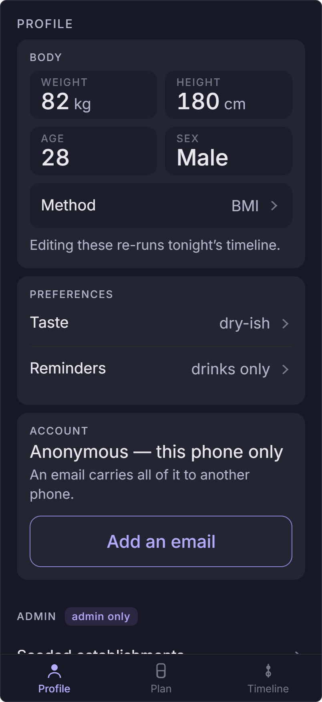

Scrolls; drawn at scroll position 0. Screen padding `20px 20px 0`, 10px between cards, cards
`#232532` radius 14 padding 16.

**Body stats are figures, not a settings list.** A 2 × 2 grid of 60px cells, gap 10, each cell
`#1c1e2c` radius 12 padding `8px 14px`: 13px/0.09em uppercase `#75798c` label over a 28px/500
tabular value with its unit at 19px `#b2b6ca`. Below the grid is one full-width 56px row: **`Method` · `BMI`** with an
18px `#75798c` chevron, the only thing on the screen that names the arithmetic.

**No body fat on the BMI path — not shown, not estimated, not mentioned.** Body fat is not in
the formula this path uses, so a row reading *Body fat 18% (estimated)* would put a number about
someone's body in front of them and imply the engine reads it, which it does not. It is collected
**only inside the FFMI input**, by the person who chose FFMI, typed by them, with **no estimated
default** — anyone tracking FFMI knows their own figure better than a formula does. When
`profile.method === "ffmi"` the grid gains a fifth 60px cell (`Body fat`, no tag) because then it
genuinely is in the maths. The `Method` row is the route between the two.

**The consequence is stated where the edit happens**, at 17px `#b2b6ca` inside the card:
*Editing these re-runs tonight's timeline.* When an edit does re-run the engine, report it with
the `1m` toast, amber variant — see `PROFILE_COPY.reRunToast` in the HTML.

**Preferences are two 56px rows**, not a settings screen: Taste (word-stop value `dry-ish`) and
Reminders (`drinks only`), each with an 18px `#75798c` chevron and a 1px `#292b31` divider
between. The two reminder switches move into that row's sheet — three switches on the tab were
what made the screen read as Settings.

**Upgrade sits third, as a fact and not a nag**: card label `Account`, a 22px line
*Anonymous — this phone only*, 17px body, then the screen's **one 64px primary** (`Add an email`,
1px `#9184d9`, radius 14, 22px/500 `#b5abfc`). It is never a banner, never at the top, and there
is no dismissable prompt anywhere else in the app.

**The admin group is below the fold, after the fading rule** — 13px uppercase `Admin` plus an
`admin only` tag, then 56px rows. It renders **only when `profile.is_admin`**; for everyone else
it is absent, never disabled and never a locked row. Nothing above it changes, so no one can tell
something is missing.

#### §C — Onboarding, two steps (`4b`, `4c`)

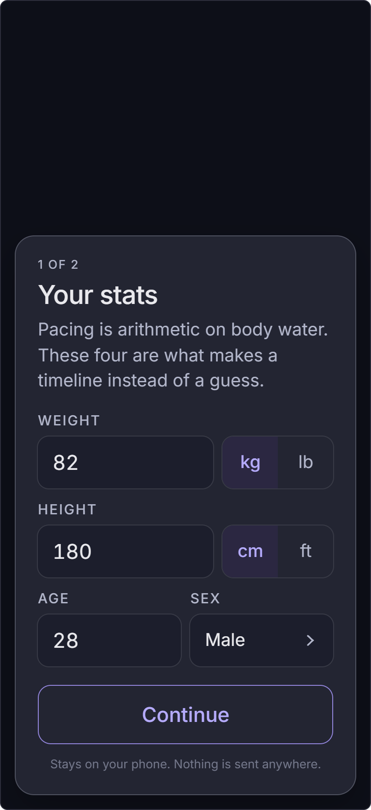
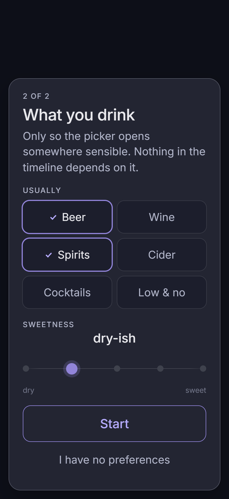

The `1l` dialog, bottom-anchored with 16px margins over the `rgba(10,11,18,.72)` scrim: panel
`#232532`, radius 20, padding 24, `0 0 0 1px rgba(147,151,171,.5), 0 16px 40px rgba(8,9,14,.65)`.
Non-dismissable, so **no X, no cancel, no backdrop tap**. Step indicator 13px uppercase, title
28/500, body 19px `#b2b6ca`.

**Step 1 asks four numbers and says why in one line** — *Pacing is arithmetic on body water.
These four are what makes a timeline instead of a guess.* Weight and height are the `1l`
numeric + unit pattern (22px tabular value, 60 × 56 segment halves); age and sex sit side by side
in a 2-column grid, gap 10, sex as the `1l` select. Continue is 64px and **stays enabled** —
it validates on tap, because a dead primary in a bar is a dead end.

**There is no fifth field, and body fat is never mentioned in first-run.** Onboarding collects
exactly the four numbers Watson TBW reads — weight, height, age, sex. That is the graceful default
the request asked us to propose: **not a defaulted body fat, but none at all.** Showing a stranger
an estimated body-fat percentage on the first screen they ever see would be stating something
about their body that the engine does not use, and it lands worst on the people it describes.
The FFMI route — the one path where body fat *is* arithmetic — lives in Profile (`4a`, the
`Method` row), entered by the user, with no estimate. Watson TBW runs unchanged either way.

**Step 2 is skippable in words, not by an X**: six 56px category chips in a 2-column grid
(selected = `0 0 0 2px #9184d9` with a 15px tick), the `1m` word-stops for sweetness, a 64px
`Start`, and beneath it a 56px ghost row *I have no preferences* — which writes
`taste = null, categories = []` and lets the picker order categories by what the venue stocks.
For someone with no preferences that ghost row **is** step two.

#### §D — Drink picker (`4d`, `4e`, `4f`)

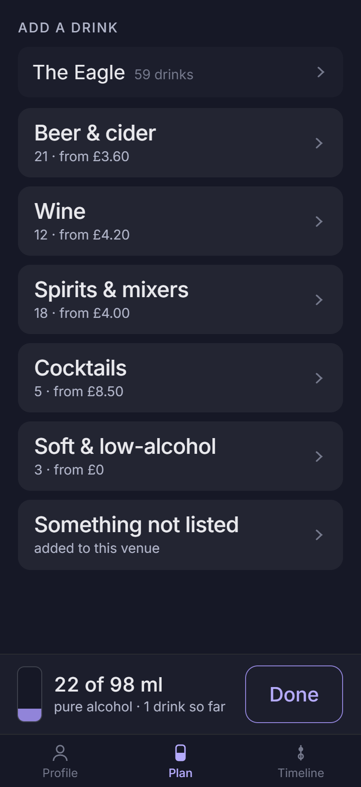
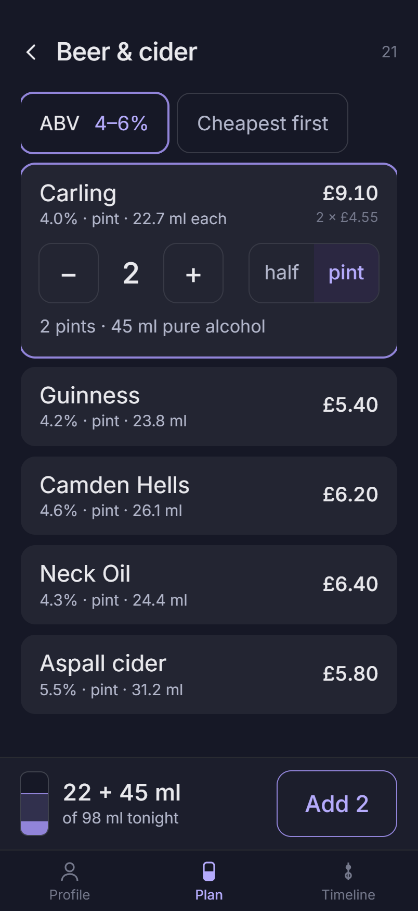
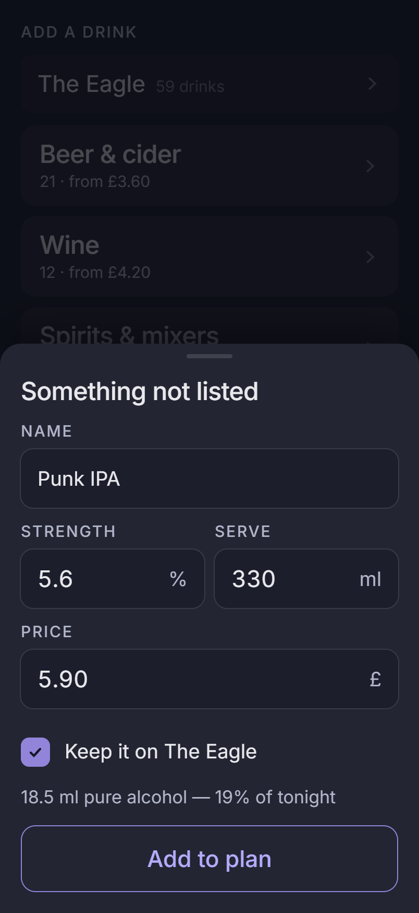

Progressive disclosure as settled. **The structure reshapes what is there rather than implying a
rewrite**: root screen = venue row + category rows; category screen = the same list component
with a different filter; the custom form is a sheet. No new navigation, no new state container.

**No toolbar, and nothing filters at the root** — there is nothing to filter yet. Inside a
category, two 56px chips (`ABV 4–6%` active with `0 0 0 2px #9184d9` and the range in
`#b5abfc`; `Cheapest first`) sit at the top of the list and **scroll away with it**. They are the
`1l` popover triggers.

**Price lives on the row**, right-aligned, 19px/500 tabular `#e9e9ed`; strength, portion and ml
sit under the name at 15px `#b2b6ca`. Category rows are 72px `#232532` radius 14; drink rows the
same.

**Quantity greater than one changes the selected row and nothing else.** Selected row takes
`0 0 0 2px #9184d9` and grows a 56px control strip: 56 × 56 steppers either side of a 28px
tabular numeral, then the half/pint segment; price becomes the total with `2 × £4.55` beneath at
13px `#75798c`; a 17px line reads *2 pints · 45 ml pure alcohol*. **The row never splits into n
rows here** — the timeline does that.

**The meter reads while you are still choosing.** The tray is fixed above the tab bar
(`#1c1e2c`, 1px `#292b31` top rule, padding `12px 20px`): a 26 × 60 vessel (`1h`, radius 7,
1px `#3f424d`), the reading at 22px tabular, a 15px sub, and the screen's one 64px action.
**Committed plan is solid `#9184d9`; the pending selection is `rgba(145,132,217,.22)` with a 1px
`#9184d9` top edge** and the reading becomes `22 + 45 ml`. Nothing is solid until `Add` is
tapped. With nothing selected the action reads `Done`.

**Custom entry is the `1m` sheet over the catalog** (radius `20px 20px 0 0`, padding
`10px 20px 20px`, 44 × 4 `#3f424d` handle, backdrop tap and swipe-down both live): name, then
strength and serve in a 2-column grid, price, a `Keep it on The Eagle` checkbox, and a live 17px
line *18.5 ml pure alcohol — 19% of tonight* which is the only thing on the sheet that moves.

#### §E — Menu scanner (`4g`, `4h`, `4i`, `4j`)

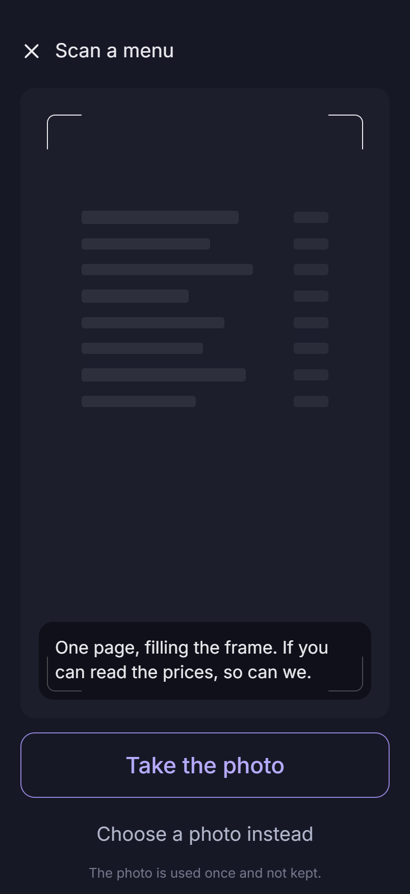
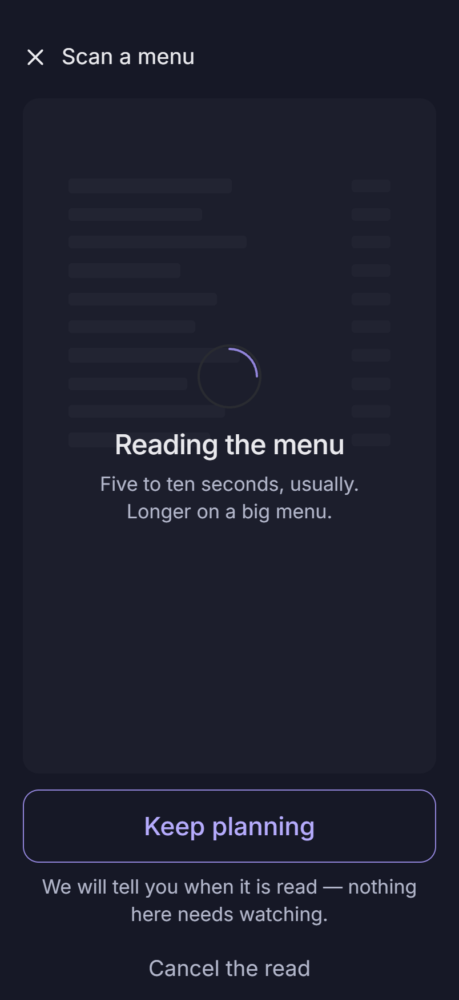
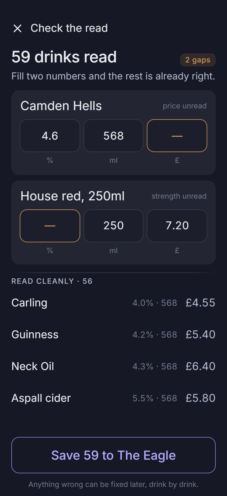
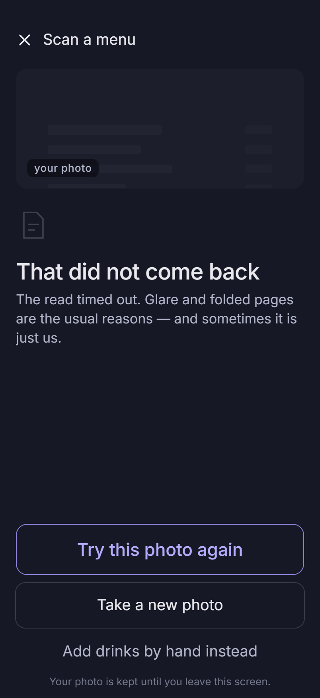

**No tab bar on any of the four** — this is a flow entered from `4k` and left by the X, and the
tabs would offer a fourth way out of a three-way screen.

**Capture** states the one thing that prevents most failures, before the shutter:
*One page, filling the frame. If you can read the prices, so can we.* — 17px `#e9e9ed` on a
`rgba(10,11,18,.72)` pill inside the viewfinder. Corner brackets are 34px, 2px `#e9e9ed`,
inset 26px. 64px `Take the photo`, 56px ghost `Choose a photo instead`.

**Waiting is leavable, and that is the design.** The 64px primary is `Keep planning`; the parse
continues in the background and lands as a `1m` toast (*59 drinks read — check them*, action
`Check`). Motion is a 90° `#9184d9` arc on a 52px `#292b31` ring, **one rotation per 1.8s,
linear, no pulse** — the only moving thing on the screen. Estimate copy swaps at 20s; timeout at
45s goes to `4j`.

**Review is the hard one, and the whole answer is the sort order.**

1. Rows with gaps come first and are tall: name 22px, reason at 13px `#75798c`, then the three
   numbers as separate 56px wells (`%`, `ml`, `£`) with 13px unit labels beneath.
2. **A gap is an amber well** — `0 0 0 1px #d29a51` showing `—` in `#d29a51`. Never an empty box,
   never a zero. Amber is the only colour on the screen; it is a remark, not an alarm.
3. Tapping a well opens the keypad **on that field** and submit advances to the next gap. Three
   gaps are three taps and three numbers, with no scrolling back. This is the new primitive.
4. Everything read cleanly collapses to one 56px line — name 19px, `4.0% · 568` at 15px
   `#75798c`, price 19px `#b2b6ca` — under a `Read cleanly · 56` header after the fading rule.
   Still tappable, but costing no height and no attention.
5. **A partly-wrong parse is never discarded.** Saving with gaps is allowed; a drink with no
   strength is stored, shows `—` in the picker and contributes 0 ml until it is filled.
6. Header: `59 drinks read` at 28/500 with a `2 gaps` tag (13px `#d29a51` on
   `rgba(210,154,81,.14)`), then 17px *Fill two numbers and the rest is already right.*
   Primary is `Save 59 to The Eagle`.

**Failure gets three ways forward, because it is common**: 64px `Try this photo again` (same
bytes — the usual fix for a timeout), 56px `Take a new photo`, 56px ghost `Add drinks by hand
instead`. The photo stays on screen as a 150px thumbnail with a `your photo` tag, and a 13px line
promises it is kept until you leave. **The title is chosen by error class**, not one generic
string — four are written in `4j`'s script block (timeout, offline, nothing-found, refused). No
red, and **not amber either**: a failed network call is not a caution about drinking.

#### §F — Establishment browsing (`4k`, `4l`)

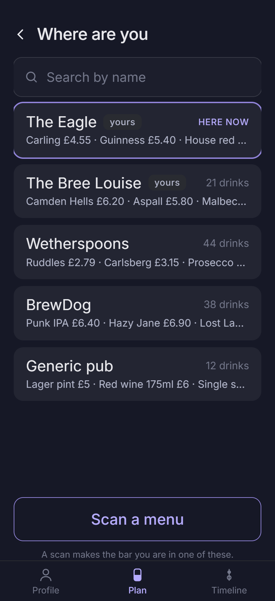
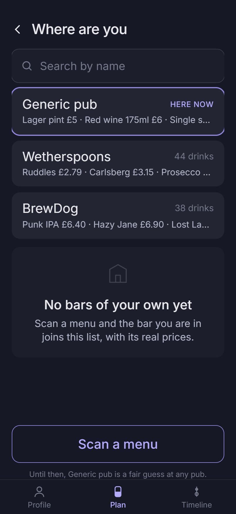

**One list, no taxonomy lesson.** Seeded venues and the user's own sit in the same list, sorted:
here-now first, then the user's own by last used, then seeded alphabetically. The only visible
difference is a `yours` tag — and it is **neutral** (13px `#b2b6ca` on `#292b31`), not accent,
because it is a fact about origin and not a status. No headers, no *Global / My venues*.

**A venue previews without a tap.** Each 72px+ card carries a second line at 15px `#b2b6ca`:
up to three of its drinks with prices, one line, ellipsis — `Carling £4.55 · Guinness £5.40 ·
House red …`. **Price is designed in ahead of the column**: when price is null the preview drops
to names only, never `£—`. Current venue takes `0 0 0 2px #9184d9` and `HERE NOW` (13px
`#b5abfc`) in place of its drink count. **No GPS: *here now* means last chosen.**

**The empty state is partial, so it sits under the list, not over it** — the seeded venues still
work. `1l` empty card (`#1c1e2c`, radius 14, 44px `#3f424d` glyph, 22px line, 17px body) with
**no action of its own**: the screen's 64px `Scan a menu` is already that offer, and two of them
is the same offer twice. The 13px footnote does the reassuring:
*Until then, Generic pub is a fair guess at any pub.*

#### §G — Account upgrade (`4m`, `4n`)

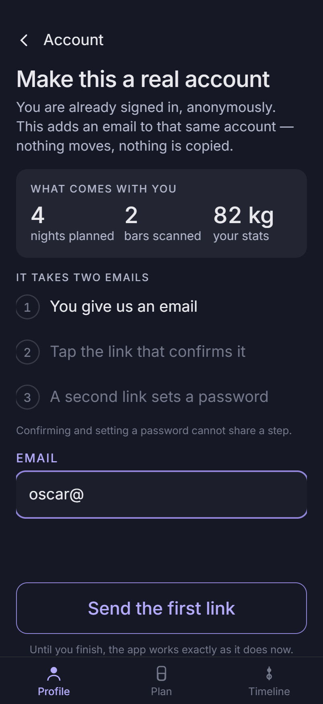
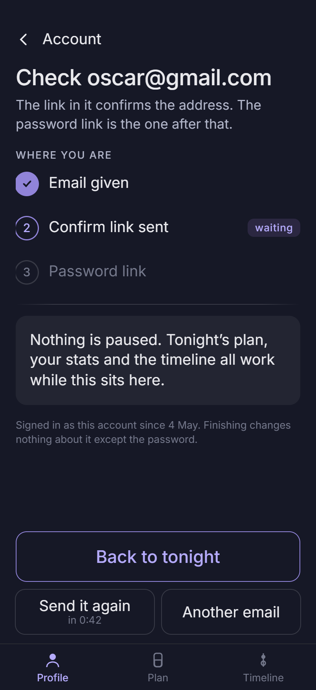

**The two-email flow is explained before the field, never after submission**, as three read-only
steps: 28px discs, 1.5px `#383a46` ring, 15px numeral, 19px label. Step three is written as a
*consequence* of step two — *A second link sets a password* — so the second email is expected
rather than sprung. One 13px line takes the blame off the user: *Confirming and setting a password
cannot share a step.*

**"Your data carries over" is counted, not asserted.** A `What comes with you` card holds three
real figures at 28px/500 with 15px labels — `4` nights planned, `2` bars scanned, `82 kg` your
stats. A column with a zero count drops out. The sentence *your data is safe* appears nowhere.

**The waiting state is a progress reading of the same three steps**: done = filled `#9184d9` disc
with a `#161826` tick; current = 1.5px `#9184d9` ring, `#b5abfc` numeral, `waiting` tag;
pending = `#383a46` ring and `#75798c` label. Title `Check oscar@gmail.com` at 28/500.

**Nothing nags and nothing blocks.** The 64px primary is `Back to tonight`; a `#232532` card
states in 19px that the plan, the stats and the timeline all work while this sits here. Resend is
rate-limited by the platform, so the 56px control carries the cooldown as a 13px line
(`in 0:42`) rather than being disabled with no explanation. This state can last days; it is
reachable from Profile and mentioned nowhere else.

#### New primitive — numeric keypad field group (`4o`)

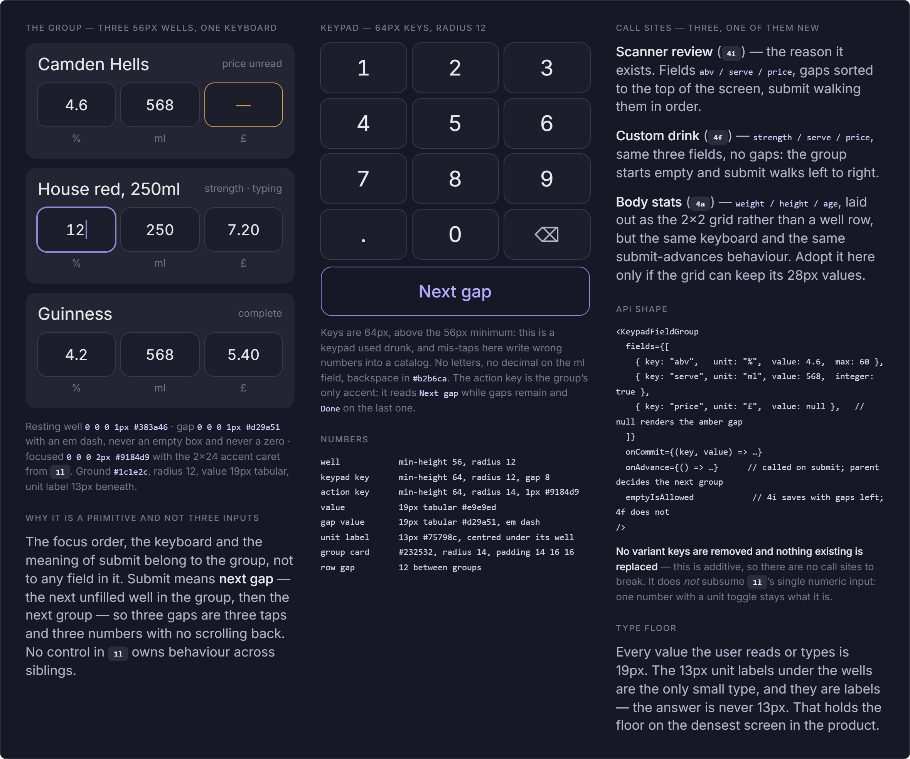

Source: `screens/4o-keypad-field-group.html`. Drawn at 1180px, the same primitive-sheet width as
`1k`/`1l`/`1m`.

**Why it is a primitive:** the focus order, the keyboard and the meaning of *submit* belong to the
group, not to any field in it. Submit means **next gap** — the next unfilled well, then the next
group — so three gaps are three taps and three numbers with no scrolling back. Nothing in `1l`
owns behaviour across siblings.

| Part | Literal |
| --- | --- |
| Well | 56px min-height, radius 12, ground `#1c1e2c`, value 19px tabular `#e9e9ed` |
| Resting well | `0 0 0 1px #383a46` |
| Gap well | `0 0 0 1px #d29a51`, value `—` in `#d29a51` — never empty, never `0` |
| Focused well | `0 0 0 2px #9184d9` + the 2 × 24 accent caret from `1l` |
| Unit label | 13px `#75798c`, centred 6px under its well |
| Keypad key | **64px** min-height, radius 12, `#1c1e2c`, `0 0 0 1px #383a46`, 28px tabular, gap 8 |
| Action key | 64px, radius 14, 1px `#9184d9`, 22px/500 `#b5abfc` — `Next gap`, then `Done` |
| Group card | `#232532`, radius 14, padding `14px 16px 16px`, 12px between groups |

Keys are 64px rather than 56px on purpose: this keypad is used drunk and a mis-tap writes a wrong
number into a venue's catalog. No letters; no decimal point on `ml`; backspace in `#b2b6ca`.

**Call sites:** `4i` (`abv / serve / price`, gaps sorted to the top), `4f` (same three, starts
empty, walks left to right), and optionally `4a` (`weight / height / age` in the 2 × 2 grid, same
keyboard and advance behaviour — adopt only if the grid keeps its 28px values). API shape is in
`4o`'s script block.

**This is additive: no variant keys are removed and no existing call site changes.** It does not
subsume `1l`'s numeric input + unit toggle — one number with a unit stays what it is.

#### Token diff for Wave 4

**None.** All fourteen frames are built from the tokens `1b`, `1k`, `1l` and `1m` already
declare. The **one new primitive** (`4o`) is built from existing tokens too; the only open naming
question left is whether the tray becomes a named component. No new colour, no new type size, no new radius.

### 1l — Form-control primitives (extends 1k)

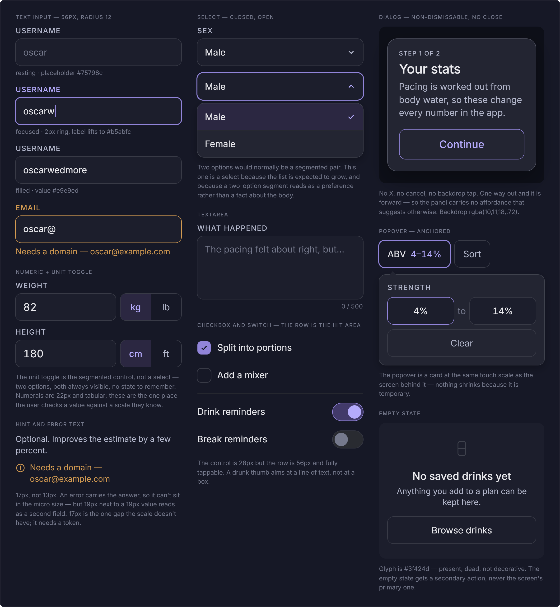

Source: `screens/1l-form-primitives.html`

The form vocabulary 1k did not cover, at the 56px touch scale. Every literal value is in the
markup. Controls are radius 12 (`--radius-ctl`); cards stay 14; the dialog is 20.

**Text input** — 56px min-height, radius 12, ground `#1c1e2c`, 19px value in `#e9e9ed`,
placeholder `#75798c`, padding `0 16px`. Four states:

| State | Treatment |
| --- | --- |
| Resting | `box-shadow: 0 0 0 1px #383a46` |
| Focused | `box-shadow: 0 0 0 2px #9184d9`, label lifts `#b2b6ca` → `#b5abfc`, 2×24px accent caret |
| Filled | as resting, value `#e9e9ed` |
| Error | `box-shadow: 0 0 0 1px #d29a51`, label `#d29a51`, message below |

Label above the field, always: 15px/0.09em uppercase `#b2b6ca`, 8px gap. Never a placeholder
standing in for a label — it disappears exactly when the user needs it.

**Numeric + unit toggle** — value input at 22px tabular, paired with a segmented unit control
(two 64×56 halves in one 1px `#383a46` pill, radius 12; active half `#2b2741` with `#b5abfc`
500-weight label). The toggle is a segment rather than a select because both options stay visible
and there is no state to remember.

**Select** — closed reads as the input with an 18px chevron in `#b2b6ca`. Open: chevron flips to
`#b5abfc`, field takes the 2px focus ring, list panel sits 8px below — `#232532`, radius 14,
`0 0 0 1px #3f424d, 0 6px 18px rgba(10,11,18,.55)`, rows 56px with a 1px `#292b31` divider, the
selected row on `#2b2741` with a `#b5abfc` tick.

*Sex is a select, not a segmented pair*, despite having two options: the list is expected to grow,
and a two-option segment reads as a preference rather than a fact about the body. Confirmed.

**Textarea** — 132px min-height, padding `14px 16px`, 19px/1.45, with a 13px tabular counter
right-aligned beneath.

**Checkbox and switch** — the drawn control is 28px but *the row is 56px and entirely tappable*.
Checkbox: radius 8, unchecked `0 0 0 1.5px #383a46`, checked `#9184d9` with a `#161826` tick.
Switch: 64×36 track, radius 18; off `#292b31` / 1px `#383a46` / `#75798c` knob; on `#423a6a` /
1px `#9184d9` / `#b5abfc` knob; knob 28px, 4px inset. A drunk thumb aims at a line of text, not
at a box.

**Dialog** — non-dismissable, so it carries **no X, no cancel, and no backdrop-tap affordance**.
Backdrop `rgba(10,11,18,.72)`; panel `#232532`, radius 20, padding 24,
`0 0 0 1px rgba(147,151,171,.5), 0 16px 40px rgba(8,9,14,.65)`. Step indicator 13px uppercase,
title 28/500, body 19px `#b2b6ca`, then one 64px primary. One way out and it is forward.

**Popover** — anchored under its trigger with an 8px caret; panel `#232532`, radius 14, padding 18,
`0 0 0 1px #3f424d, 0 6px 18px rgba(10,11,18,.55)`. Contents stay at full touch scale — nothing
shrinks because it is temporary.

**Empty state** — `#1c1e2c`, radius 14, padding `32px 18px`, centred: 44px glyph in `#3f424d`
(present, dead, not decorative), 22px line, 17px `#b2b6ca` sub, then a **secondary** 56px action.
An empty state never gets the screen's primary action.

**Inline hint and error** — both 17px (`--fs-note`). Hint `#b2b6ca`; error `#d29a51` with a 20px
warning glyph, 10px gap, glyph offset 2px from the top.

**Error copy rule: an error names what is needed, never what the user did wrong.**
`Needs a domain — oscar@example.com`, not "invalid email". `Between 40 and 250 kg`, not "out of
range". Wording for the remaining fields is pending sign-off and is not yet written into the design.

### 1m — Sheet, radio group, word-stops, time picker, toast

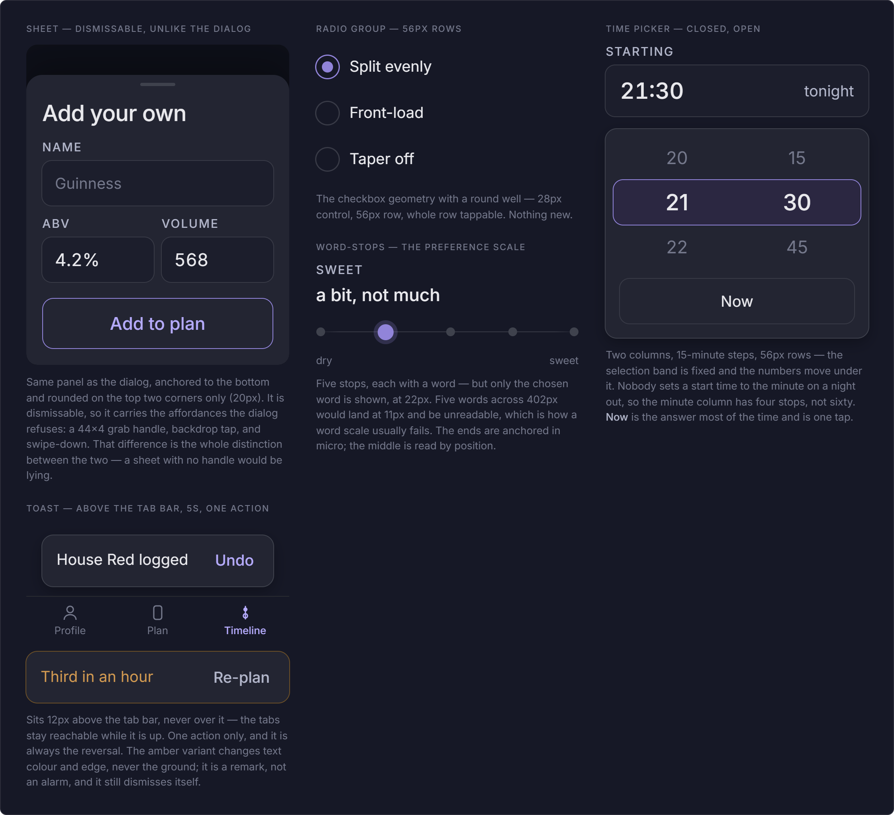

Source: `screens/1m-sheet-radio-time-toast.html`

**No new tokens.** All five are built from what 1k and 1l already declare — the sheet is the dialog
panel bottom-anchored at `--radius-sheet`, the radio is the checkbox at `--touch-control` in a
round well, the picker rows are `--touch-min`, the toast is a card at `--radius`. That the set
closed without additions is the check that the token layer is right.

**Sheet / drawer** — the custom-drink form and anything else summoned from a screen. Same panel as
the dialog (`#232532`, `0 -16px 40px rgba(8,9,14,.65)`, backdrop `rgba(10,11,18,.72)`), anchored
to the bottom, radius `20px 20px 0 0`, padding `10px 20px 20px`. It **is** dismissable, so it
carries the affordances the dialog refuses: a 44×4 `#3f424d` grab handle (radius 2, 18px below),
backdrop tap, and swipe-down. That difference is the entire distinction between sheet and dialog —
a sheet without a handle would be lying about whether you can leave.

**Radio group** — 28px control in a 56px row, whole row tappable. Unselected
`0 0 0 1.5px #383a46`; selected `0 0 0 1.5px #9184d9` with a 14px `#9184d9` centre. Checkbox
geometry with a round well; nothing new.

**Word-stops** — the Sweet / Strong preference scale. Five stops, each with a word, but **only the
chosen word is shown**, at 22px above the track. Five words laid across 402px would land near 11px
and be unreadable, which is how a word scale usually fails. Track is the fading rule (30px fade),
stops are 11px `#3f424d`, selected is 20px `#9184d9` with `0 0 0 5px rgba(145,132,217,.22)`, row
56px. Ends anchored in 13px `#75798c` (`dry` … `sweet`); the middle is read by position.

**Time picker** — session start. Closed: a 64px field, 28px tabular value, `tonight` qualifier in
19px `#b2b6ca`. Open: two columns, 56px rows, a **fixed** selection band
(`#2b2741`, radius 12, `0 0 0 1px #9184d9`, inset −8px) with the numbers moving under it;
centre row 28px/500 `#e9e9ed`, neighbours 22px `#75798c`. **Minutes have four stops, not sixty** —
nobody sets a start time to the minute on a night out. A 56px `Now` sits below and is the answer
most of the time.

**Toast** — `#232532`, radius 14, `0 0 0 1px #3f424d, 0 6px 18px rgba(10,11,18,.55)`, 64px
min-height, message 19px, one action at 56px in `#b5abfc`. Sits in the 20px gutters, **12px above
the tab bar and never over it**, so the tabs stay reachable while it is up. Auto-dismisses at 5s.
The action is always the reversal — `Undo`, not `Dismiss`. Amber variant swaps text to `#d29a51`
and the edge to `#6b4f27`, leaving the ground alone: it is a remark, not an alarm, and it still
dismisses itself.

### 1n / 1o — Buzz picker, four bands — **supersedes 1c**

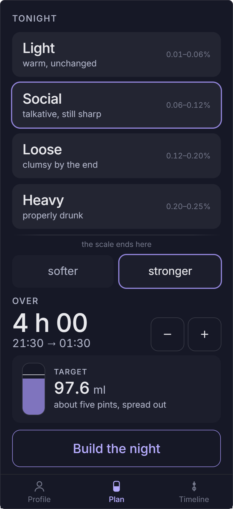
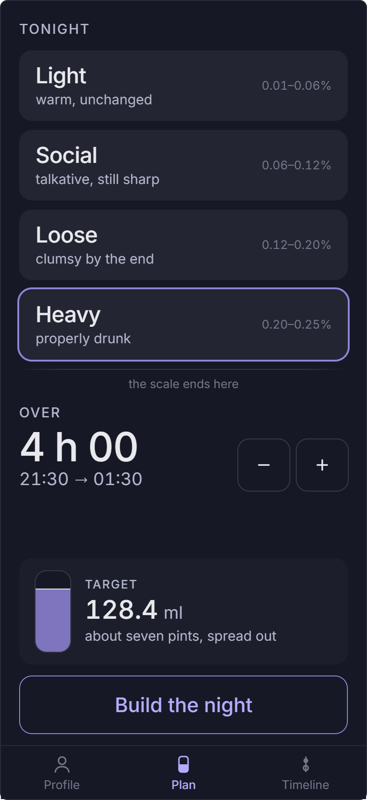

Source: `screens/1n-buzz-picker-four-band.html`, `screens/1o-buzz-picker-heavy.html`

**1c below is out of date — build from 1n/1o.** The ceiling is level 7, not 6; levels 8–10 are
gone from the product, not locked or shown as forbidden. Four bands:

| Band | levels | subtitle | BAC shown |
| --- | --- | --- | --- |
| Light | 1–2 | warm, unchanged | 0.01–0.06% |
| Social | 3–4 | talkative, still sharp | 0.06–0.12% |
| Loose | 5–6 | clumsy by the end | 0.12–0.20% |
| Heavy | 7 (alone) | properly drunk | 0.20–0.25% |

Heavy's subtitle was changed from the proposed "gaps in the night" to **"properly drunk"**.
The original implied blackout, which is not what level 7 is — and describing it that way in the app
would be inaccurate as well as alarming. Levels 8–10 were removed from the product precisely so
that nothing in the interface has to talk about blackout territory; the copy must not reintroduce it.

Social's subtitle was changed from the proposed "loose, still sharp" — the same word cannot be a
band name one card below and a description here.

**Heavy carries no warning treatment of any kind**: same `#232532`, same radius 14, same
`0 0 0 2px #9184d9` ring on selection, same 13px `#75798c` range. No confirmation step, no amber,
no extra affordance. The only thing marking the end is the fading rule and `the scale ends here`
(13px `#75798c`, centred) directly beneath the last card. The scale stops because that is where it
stops.

**Heavy is a single level, so the softer/stronger pair is removed from the DOM, not disabled** — an
inert control a drunk thumb taps and gets nothing from is worse than no control. The 66px this frees
(56px row + 10px margin) is absorbed by the `margin-top:auto` spacer above the target card.

**Verified, not asserted:** in both frames `Build the night` sits at y=738 and the target card at
y=610 within the 874px screen. Getting there required 20px of margin trimmed above the spacer —
with four cards the default frame overflowed by 10px, so the spacer had no slack and the button
jumped 12px between states. The trims, all of which the implementation must keep or the guarantee
breaks:

```diff
- screen padding      28px 20px 0        → 22px 20px 0
- fading rule margin  14px 0 10px        → 10px 0 8px
- duration block      margin-top: 18px   → margin-top: 14px
- nudge row           margin-top: 14px   → margin-top: 10px
```

Unchanged from 1c: 10px between cards, 72px card min-height, ring-never-fill selection, 56×56
duration steppers at 30-minute steps from 1h to 8h, the 38×88 vessel meter in the target card, and
the 64px `Build the night`. No new tokens.

### 1c — Plan / buzz picker (superseded by 1n/1o)
Replaces the 1–10 slider in `src/components/tabs/PlanTab.tsx`.


Source: `screens/1c-buzz-picker.html`

**Purpose:** choose how drunk you intend to get, and over how long.

**The core change:** the 1–10 scale is gone from the UI. Three named bands:

| Band | maps to `buzzLevels` | subtitle | BAC range shown |
| --- | --- | --- | --- |
| Light | 1–2 | warm, unchanged | 0.01–0.06% |
| Social | 3–4 | loose, still sharp | 0.06–0.12% |
| Loose | 5–6 | clumsy by the end | 0.12–0.20% |

Levels **7–10 are unreachable in the UI**. The consequence: the danger warning has nothing
to warn about, so it is deleted. Below the three cards sits a fading rule with the text
*"the scale ends here"* (13px, `#75798c`) — the scale visibly stops rather than silently
truncating.

**Layout**, top to bottom, 20px gutter, 64px top padding:

1. Label `TONIGHT` (15/0.09em uppercase, `#b2b6ca`), 20px below.
2. Three band cards, 10px gap. Each: `min-height 72px`, padding `14px 18px`, `#232532`,
   radius 14, row with name (500/24) + subtitle (400/15 `#b2b6ca`) on the left, BAC range on
   the right (13px mono, `#75798c`, tabular). Selected state: `box-shadow: 0 0 0 2px #9184d9`
   — a ring, no fill, no colour change.
3. `softer` / `stronger` nudge pair — two 56px buttons, flex 1, 12 radius, `#1c1e2c`,
   19px label. These select the lower/upper level *within* the chosen band. Selected: same
   accent ring. Default is the lower level of the band with neither nudge active.
4. Fading rule, 18px above / 14px below.
5. Duration block: label `OVER`, value at 44px display (`4 h 00`), and `21:30 → 01:30` at
   19px `#b2b6ca` below. Right side: two 56×56 stepper buttons (− and +, 1px `#383a46`,
   radius 12), 30-minute increments. Range 1 h – 8 h.
6. Pushed to the bottom (`margin-top:auto`): the target card — `#1c1e2c`, radius 14,
   padding `14px 18px`. Left: the vertical vessel meter, 38 × 88, 1px `#383a46`, radius 12,
   accent fill rising from the bottom at 85% opacity, animating over `--transition-liquid`,
   with a 1px `#e9e9ed` target line at 78% height. Right: `TARGET` micro label, the ml figure
   at 28px with a 19px `ml` suffix in `#b2b6ca`, and a one-line note whose colour is
   `#b2b6ca` normally and `#d29a51` when the plan runs over target.
7. Primary action: `Build the night` — 64px, 1px `#9184d9` outline, radius 14, label
   500/22 in `#b5abfc`. **Outlined, never filled.**
8. Tab bar.

**Interactions:** tapping a band sets the level and recomputes target ml and fill height;
softer/stronger shifts within the band; the steppers change duration and the end clock. All
value changes animate the fill over 900ms. No haptics spec'd; add the platform default light
impact on band selection if cheap.

### 1d — Timeline (recommended)
Replaces `src/components/tabs/TimelineTab.tsx` + `SortableTimelineItem.tsx`.

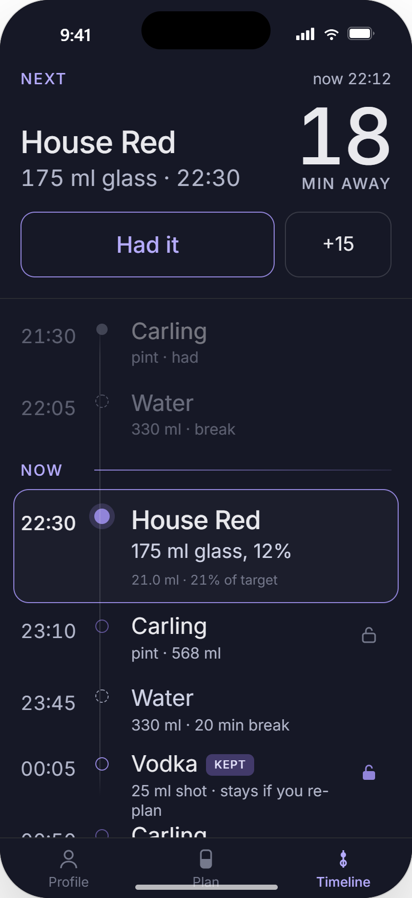

Source: `screens/1d-timeline.html`

**Purpose:** what's next, how long until it, and what the rest of the night looks like.

**Structure:** a fixed hero pinned to the top and a scrolling spine below it. The hero never
scrolls away — it is the answer to the only question the user has.

**Hero** (padding `8px 20px 20px`, 1px `#292b31` bottom rule):
- Row: `NEXT` (15/0.09em uppercase, `#b5abfc`) left, `now 22:12` (15px `#b2b6ca`, tabular) right.
- Row: drink name 500/30 and `175 ml glass · 22:30` at 22px `#b2b6ca`, left; the countdown
  numeral at 76/0.92 with `MIN AWAY` beneath it, right.
- Actions, 10px gap: `Had it` — flex 1, 64px, accent outline, `#b5abfc` 500/22; `+15` —
  104 × 64, 1px `#383a46`, 19px. Two actions, always the same two, always in the same places.

**Spine** (scrollable, `padding: 18px 20px 8px`, hidden scrollbar): a 1px fading vertical
rule at x = 97px. Each row is `[62px time] [34px marker] [flex content]`.

Row types:

| Type | Marker | Text |
| --- | --- | --- |
| Past drink | 11px solid `#75798c` dot, whole row at `opacity .45` | name 22px, `pint · had` 15px |
| Water / break | 13px dot, 1px **dashed** `#9397ab`, hollow (`#161826` fill) | `Water` in `#cfd3e5`, `330 ml · 20 min break` |
| Now marker | — | `now` label in `#b5abfc` + a 1px rule fading accent → transparent |
| Next drink (hero row) | 15px solid `#9184d9` with `0 0 0 5px rgba(145,132,217,.22)` halo | raised card: `#1c1e2c`, radius 14, `0 0 0 1px #9184d9`, margin `0 -6px 10px`; name 500/25, `175 ml glass, 12%` 19px, `21.0 ml · 21% of target` 13px `#75798c` |
| Future drink | 13px, 1.5px `#5d5294` outline, hollow | name 22px, detail 15px; optional 44px trailing lock button |
| Locked ("kept") | 13px, 1.5px **`#9184d9`** outline, hollow | name + `kept` chip (11px/0.06em uppercase, `#423a6a` bg, `#e7e5fe` text, radius 6), detail `25 ml shot · stays if you re-plan`; filled padlock glyph in accent |
| Plan end | 23px horizontal dash | `Plan ends`, `sober around 08:30` 15px `#75798c` |

Footer of the spine: `Add a drink` and `Re-plan the rest` — two flex-1 buttons, 56px, 1px
`#383a46`, radius 14, 19px.

**Copy rule:** unplanned additions and locked drinks read as *adjustment*, never breakage.
Never "you've gone off plan".

### 1e — Timeline, alternate layout (proportional time axis)
Same content, but rows are absolutely positioned so vertical distance is proportional to
elapsed time — pacing becomes the shape of the screen. Hero is compressed (60px numeral,
no card), actions move to a fixed footer above the tab bar. Spine at x = 76px, rows
`[56px time] [20px marker] [content]`.

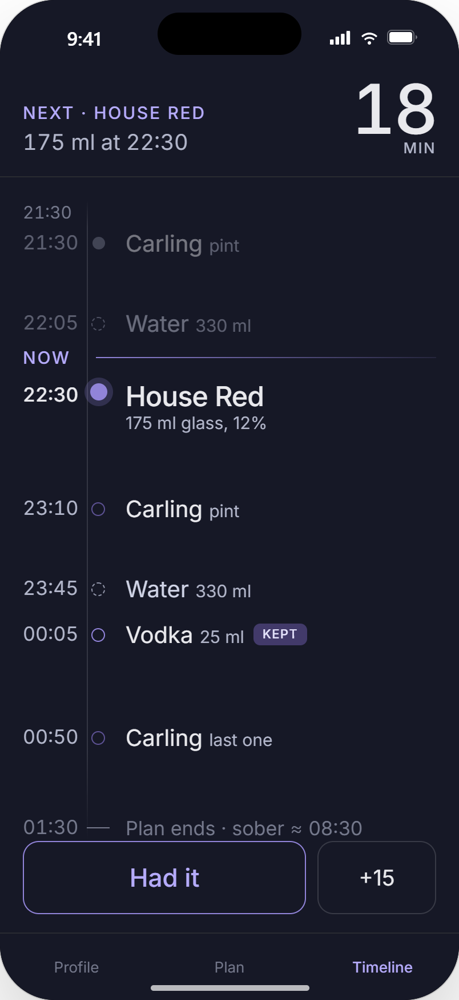

Source: `screens/1e-timeline-time-axis.html`

Worth building only if you can guarantee the whole night fits without scrolling; otherwise
ship **1d**. Treat this as an option, not a requirement.

### 1f — Wind-down (new — needs engine work)
Does not exist in the repo. Entered when the last planned drink has been logged, or the plan
end time has passed.


Source: `screens/1f-wind-down.html`

**Purpose:** close the session honestly. No score, no streak, no praise.

- `WINDING DOWN` label; one line of context: *"Last drink 00:50, 40 minutes ago. Nothing else planned."*
- `SOBER AROUND` + the time at 76px hero. Elimination assumed at **0.015 %/h**.
- Three stat rows, 1px gaps, `#1c1e2c`, 60px min-height, padding `0 18px`, radii cornered
  as a group (`14 14 4 4` / `4` / `4 4 14 14`): `Under 0.08%` → `03:10`; `Peak tonight` →
  `0.11%`; `Drunk of planned` → `76 / 98 ml`. Label 19px `#cfd3e5`, value 500/22 tabular.
- Disclaimer, 13px `#75798c`: *"Estimates from your stats and what you logged. Not a legal or medical measurement."* — required, keep the wording.
- One care card: `Water, 500 ml` (500/22) + *"Before bed. Set a reminder for 07:30 if you have somewhere to be."*
- Bottom: `Get home` (64px, `#383a46` outline) and `End session` (56px, text-only, `#b2b6ca`).

Nothing here says the user did well. That is the design.

### 1g — Notification (design this as a screen, it is the real interface)
Most of the product happens on the lock screen. `useNotifications.ts` /
`useWebDrinkReminders.ts` should produce exactly this.

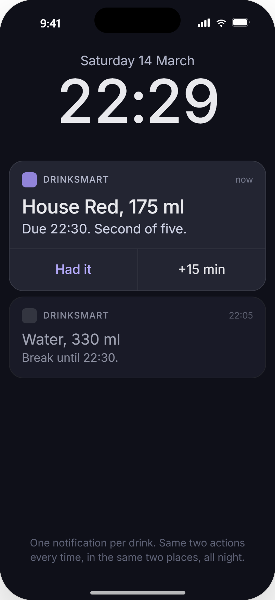

Source: `screens/1g-notification.html`

- One notification per drink, fired at the scheduled time.
- Card: `#232532`, radius 20, `0 0 0 1px #383a46`. App row: 22px accent square + `DRINKSMART`
  (13px/0.08em uppercase `#b2b6ca`) + relative time right.
- Title `House Red, 175 ml` (500/28); body `Due 22:30. Second of five.` (19px `#cfd3e5`).
- Action row divided by a 1px rule: **`Had it`** (`#b5abfc`, 500/19) and **`+15 min`**
  (`#e9e9ed`, 400/19), each 60px min-height, split 50/50 by a 1px vertical rule.
- Break notifications are the quieter variant: `#1c1e2c`, `opacity .75`, no actions —
  `Water, 330 ml` / `Break until 22:30.`

**The rule:** the same two actions, in the same two places, every time, all night. A drunk
thumb should not have to read. Both actions must work without opening the app.

### 1h / 1i / 1j — Pure-alcohol meter
Replaces the battery meter at `src/components/tabs/DrinksTab.tsx:878–990`. A vertical vessel,
never a battery, never a progress bar. Three forms of the same object — pick one and use it
everywhere:

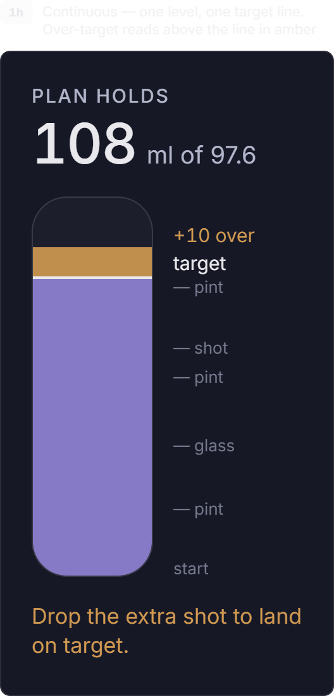
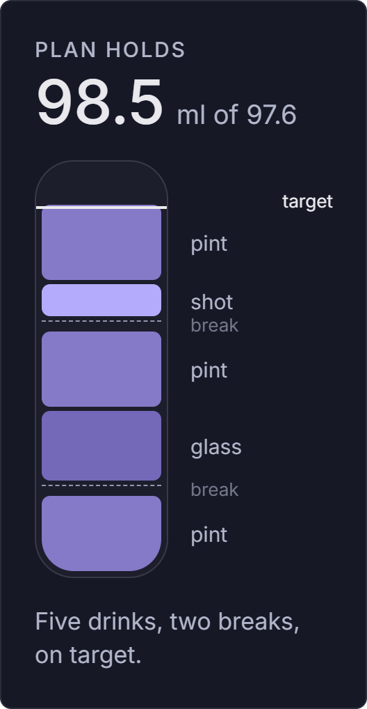


Source: `screens/1h-meter-continuous.html`, `1i-meter-segmented.html`, `1j-meter-mid-session.html`

- **1h Continuous** — one rising level, one 1px target line. Over-target fill reads above
  the line in `#d29a51`. Simplest; recommended.
- **1i Segmented** — one block per drink, breaks as gaps. Countable at a glance; a block is
  tappable to see the drink.
- **1j Mid-session** — drunk-so-far solid, still-planned hollow, a now-line across. This is
  the form to use inside the Timeline.

All three: 1px `#383a46` container, radius 12, accent fill at 85% opacity, filling animated
with `--transition-liquid` (900ms). Numbers alongside are tabular; the ml figure is the
answer, the percentage is micro detail.

### 1k — Primitives
Buttons, cards, slider, tabs, badges and meter at the sizes the app actually uses them.
Map onto the existing `src/components/ui/*` shadcn primitives — restyle those, don't fork:


Source: `screens/1k-primitives.html`

- **Primary button** — 64px, accent 1px outline on transparent, radius 14, 500/22 `#b5abfc`. Never a solid fill.
- **Secondary button** — 56px, 1px `#383a46`, 400/19 `#e9e9ed`.
- **Card** — `#232532` (or `#1c1e2c` raised), radius 14, no shadow; selection is a 2px accent ring.
- **Badge / chip** — 11px/0.06em uppercase, `#423a6a` on `#e7e5fe`, radius 6, padding `5px 8px`.
- **Tabs** — the bottom bar described above; the shadcn top-tabs pattern is not used.

---

## State & engine work required

Three things the current engine cannot express. These are backend/logic tasks, not styling:

1. **Breaks and water entries.** The engine assumes every timeline entry carries ethanol; a
   0% ABV / 0 ml-alcohol row cannot be represented. The break row is driven by **duration,
   not ethanol** — it needs its own entry type with a duration, an optional volume, and no
   BAC contribution.
2. **Wind-down state.** A session needs a terminal state with a sober-by estimate
   (0.015 %/h elimination), a time-under-0.08% figure, a peak BAC, and drunk-vs-planned totals.
3. **Locking + regeneration.** Individual drinks must be lockable (`kept`) and the remainder
   of the plan regenerated around them when the user re-plans, adds an unplanned drink, or
   pushes one back by 15 minutes.

UI state per screen: selected band + nudge, session duration and start time (Plan); logged
entries, current time, locked ids, scroll position (Timeline); session phase (planning /
active / winding down).

## Assumptions — please challenge these

- Band → level mapping (Light 1–2 / Social 3–4 / Loose 5–6) and the removal of 7–10.
- Demo profile: 82 kg, 180 cm, 28, male; 4 h session from 21:30. Watson TBW, UK units
  (568 ml pint, 175 ml glass, 25 ml shot, £).
- Elimination 0.015 %/h for the sober-by estimate.

## Not designed yet

**Nothing outstanding from §A–§G.** Onboarding, Profile, the drink picker, auth / account upgrade,
the menu scanner and establishment browsing are all drawn — see *Wave 4* above. Still undrawn and
not requested: the drink-detail edit screen reached from a saved catalog row, and the
notification-permission prompt. Directions that were settled before those six were drawn: the drink catalog resolves its
density conflict by **progressive disclosure** (categories first, drinks inside); custom-drink
entry is a **sheet over the catalog**; the Profile **Appearance card is cut**, with the argument
drawn; establishments are **two-tier** (global seeded venues plus the user's own from the scanner),
name-only, no GPS, with **price designed in** ahead of the column existing.

## Files in this bundle

| File | What it is |
| --- | --- |
| `README.md` | This file — the spec. Self-sufficient. |
| `screens/*.png` | Rendered image of each design, 2x. Look at these. |
| `screens/4o-keypad-field-group.*` | Wave 4's one new primitive — the numeric keypad field group. |
| `screens/4a`–`4n` | Wave 4: §B Profile, §C onboarding, §D picker, §E scanner, §F establishments, §G auth. Each HTML carries its copy and formatting rules in a trailing `<script>`. |
| `screens/*.html` | Exact inline-styled markup for each design. Port, don't paste. |
| `tokens/index.css` | Production drop-in for `src/index.css` |
| `tokens/tailwind.config.ts` | Production drop-in for `tailwind.config.ts` |
| `DrinkSmart-design-reference.html` | The full interactive design doc, for a human in a browser. Do not parse. |
