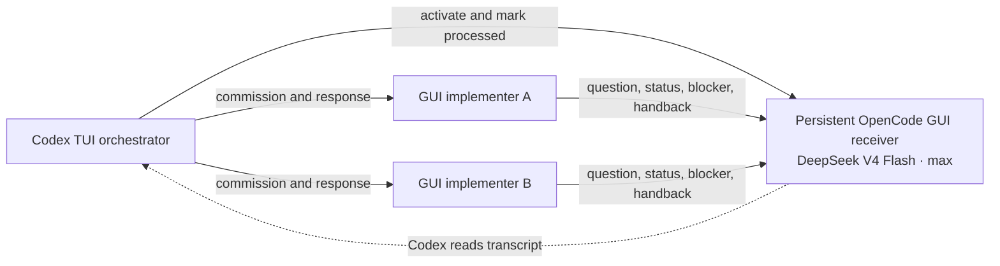

# Codex TUI Message Receiver

## Purpose and boundary

Use this adapter only when a **Traycer-launched Codex TUI is the orchestrator**. Codex TUI can
create agents, inspect their transcripts and send outbound messages, but it cannot expose inbound
agent-to-agent replies. One persistent OpenCode GUI agent therefore acts as the epic's inbound
receiver, and Codex TUI reads that receiver's transcript.

This is a messaging adapter, not a workflow. It does not change how work is specified,
implemented, checked, repaired or integrated. `AGENTS.md`, `docs/decisions.md`, the applicable
workflow, `writespec` and `speccheck` retain their existing authority.

Terminology:

- **Adapter** means this complete Codex-TUI-specific messaging system.
- **Receiver** means the persistent OpenCode GUI/DeepSeek agent that holds the inbound transcript.
  It does not forward messages, answer questions or make decisions.

## Activation rule

Codex TUI is authorized as orchestrator only while `$codex-tui-relay` is active. Invoke the skill:

- before a Codex TUI commissions any GUI agent;
- whenever a later Codex TUI resumes orchestration in the epic;
- before checking for implementation-agent questions, blockers or handbacks; and
- before responding through the receiver system.

Do not activate it for Codex GUI, Claude Code, OpenCode, or a Codex implementation agent. Codex
implementation agents always use the GUI surface. Claude Code TUI uses its native bidirectional
agent-to-agent messaging and does not use this receiver.

## Topology



The dotted edge is a transcript read, not an inbound Traycer message.

## Receiver identity and lifecycle

Each Traycer epic has at most one active receiver named:

```text
codex-tui-receiver
```

The first Codex TUI orchestrator creates it. The receiver remains idle whenever Codex TUI is not
orchestrating. A later Codex TUI reuses the same receiver, reads its transcript and reconstructs
pending state from processed markers before commissioning or answering anyone.

Do not create one receiver per Codex session. Do not delete the persistent receiver silently; its
transcript is the cross-session inbox record. If it becomes unusable, create a numbered replacement,
redirect active implementation agents outbound and mark the former receiver superseded.

## Locate or provision

Read `TRAYCER_AGENT_ID` before claiming the current orchestrator identity. List the epic's agents and
look for the exact receiver name. If multiple plausible active receivers exist, stop and resolve the
ambiguity rather than dividing the inbox.

When no receiver exists, create it in the normal DrinkSmart repository context without a worktree:

```text
traycer agent create --name codex-tui-receiver --harness opencode \
  --model deepseek:deepseek-v4-flash --reasoning-effort max --surface gui \
  --cwd <DrinkSmart-repository-root> --permission-mode full_access
```

This simple arrangement deliberately relies on DeepSeek's instruction following. The receiver is
not an implementer and must never edit the repository even though it has `full_access`.

Creation can time out while leaving behind a silently misconfigured agent. A clean returned agent ID
is necessary but not sufficient. After the first turn, follow `docs/workflows/agent_selection.md`:
use `opencode session list` and `opencode export <session-id>` to confirm
`deepseek / deepseek-v4-flash / max`. Also confirm that the receiver used no tools and made no
filesystem or Git changes.

## Initialize a new receiver

Send this exact role message as a `[no-spec]` communication:

```text
[no-spec]
You are the persistent passive inbound mailbox for Codex TUI orchestrators in this Traycer epic.

For every inbound message:
1. Do not answer its substantive content.
2. Do not make decisions, use tools, inspect files, modify files, or contact other agents.
3. Preserve the incoming message in this conversation transcript.
4. Respond only with: RECEIVED <message-id>

Messages with kind CONTROL are written by the orchestrator to mark activation or processing state.
Treat them the same way. You are not an orchestrator, implementer, reviewer, or fallback
decision-maker.

When no Codex TUI orchestrator is using you, remain idle. A later Codex TUI orchestrator may read
this transcript and activate you again; continue the same passive behavior without interpreting
earlier messages.
```

The incoming prompt is the payload preserved in the transcript. The receiver's response is only a
receipt. If the receiver uses a tool, edits a file, answers substantively or contacts another agent,
stop using it, inspect for side effects and provision a replacement.

## Activate or resume

Before using either a new or reused receiver:

1. Read its transcript with `traycer agent transcript --agent-id <receiver-id>`.
2. Confirm that it has remained passive.
3. Match each inbound `message_id` to a later `PROCESSED` control marker.
4. Treat any unmatched question, blocker or handback as pending.
5. Send this activation marker:

```text
[no-spec]
[codex-tui-receiver-control]
kind: ACTIVATED
orchestrator_agent_id: <current TRAYCER_AGENT_ID>
[/codex-tui-receiver-control]
```

The marker records who is currently operating the inbox. It does not give the receiver authority to
choose, transfer or enforce ownership.

## Implementer message envelope

Every usable implementation-agent message goes to the receiver in this form:

```text
[codex-tui-receiver]
ticket: <stable ticket or spec id>
sender_agent_id: <full Traycer agent id>
message_id: <ticket>-<sender-short-id>-<monotonic sequence>
kind: QUESTION | BLOCKER | STATUS | HANDBACK
reply_required: yes | no
[/codex-tui-receiver]

<complete message body>
```

Rules:

- A `message_id` is unique within its delegation and is never reused.
- The sender always includes its full agent ID, even if transcript metadata also identifies it.
- The implementer sends the envelope explicitly with
  `traycer agent send --to <receiver-id> --message <envelope-and-body>`.
- The implementer-to-receiver send does not use `--expect-reply`; DeepSeek is not the substantive
  responder.
- The receiver never interprets, summarizes or answers the message.

## Commissioning from Codex TUI

Continue to commission implementations with a compliant `writespec` specification and
`--expect-reply`. Add this transport preamble, with the actual receiver ID, to the commission:

```text
Communication route — transport only

The assigning Codex TUI cannot receive agent-to-agent replies directly. For every necessary
question, blocker, status update or final handback, explicitly run
`traycer agent send --to <receiver-id>` with the codex-tui-receiver envelope before ending your
turn. The receiver cannot answer you; the orchestrator will read its transcript and respond
directly to your agent ID.

Continue any safe, independent work while waiting. Do not weaken or reinterpret the specification
because a question channel exists.
```

`--expect-reply` opens Traycer's native response thread back to the original Codex TUI sender. That
thread cannot be redirected to a third agent and is not a usable inbound channel in Codex TUI. The
explicit send to the receiver is therefore the authoritative usable version of every question,
status, blocker and handback.

The availability of the receiver does not lower the `writespec` standard. Write every specification
as though clarification will not be available so foreseeable questions are resolved before
dispatch. An implementer may still use the receiver for genuinely unforeseen uncertainty.

## Read, answer and mark processed

While implementation agents are active, poll the one receiver transcript:

- after every outbound commission;
- before declaring an agent stalled or complete;
- whenever returning from other orchestration work; and
- at regular short intervals while explicitly waiting for handback.

For each pending message:

1. Read the complete envelope and body.
2. Send the answer directly outbound to `sender_agent_id`.
3. Send the receiver this processed marker:

```text
[no-spec]
[codex-tui-receiver-control]
kind: PROCESSED
message_id: <handled message id>
response_sent_to: <sender agent id>
processed_by: <current TRAYCER_AGENT_ID>
[/codex-tui-receiver-control]
```

A message is logically unread until a later matching `PROCESSED` marker exists. This state survives
Codex context compaction, a TUI restart and a later Codex TUI orchestration session. Answer duplicate
messages at most once.

## Questions and handbacks

For a question or blocker, Codex responds directly to the implementation agent and then marks the
receiver message processed. The implementation agent sends any follow-up back through the receiver.

At completion, the original commission still has `--expect-reply`. Before ending its completion
turn, the implementer sends its complete clause mapping, verification result and uncertainty report
to the receiver as a `HANDBACK`. The receiver handback is the only usable inbound completion signal
for Codex TUI. `speccheck` and the applicable integration workflow remain the sole acceptance path.

## Failure recovery

| Failure | Recovery |
| --- | --- |
| Receiver creation times out or is misconfigured | Do not dispatch; remove or retire it through Traycer's supported UI and retry |
| Receiver acts beyond acknowledgement | Stop using it, inspect side effects, create a replacement and redirect active agents |
| Receiver transcript is unavailable | Read active implementation-agent transcripts temporarily and provision a replacement |
| Implementer sends only a native reply | Recover from that agent's transcript, then remind it outbound to use the receiver |
| Message lacks ticket or sender identity | Resolve it from the source transcript; never guess a response target |
| Later Codex TUI takes over | Reuse the receiver, reconcile pending messages, then write a new activation marker |

A receiver failure never authorizes Git resets, worktree deletion, redispatch, acceptance without
review, or any change to the code-production workflow.

## No-code smoke test

Before relying on this adapter for real work, demonstrate that:

1. a fresh Codex TUI discovers `$codex-tui-relay` from `AGENTS.md`;
2. the skill locates the epic's receiver or creates exactly one;
3. the receiver actually runs OpenCode / DeepSeek V4 Flash / max / GUI;
4. it records a test `QUESTION` without answering substantively, using tools or changing Git;
5. Codex TUI reads the question and sends a direct outbound answer;
6. Codex adds a processed marker and a second scan finds no unread message;
7. a later Codex TUI reuses the same receiver and writes a new activation marker; and
8. a non-Codex or non-TUI agent declines to activate the adapter.
