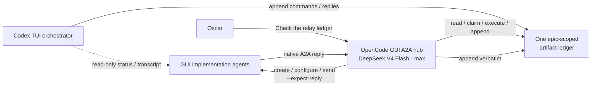

# Codex TUI artifact relay

## Purpose and boundary

Use this adapter only when a **Traycer-launched Codex TUI is the orchestrator**. Traycer does not
allow that terminal agent to create or message A2A agents, so one user-created OpenCode GUI agent
performs those operations. Codex and the GUI hub exchange commands and replies through one
append-only Traycer artifact.

This is a transport adapter, not a delegation workflow. Codex remains the orchestrator and retains
all decisions. `writespec`, `speccheck`, `docs/workflows/delegation.md`, agent-selection approval
gates and change-safety rules remain authoritative.

## Topology



Codex never calls a mutating Traycer agent command. Because the hub issues each Codex-authored
commission, native `--expect-reply` responses return to the hub; implementers do not need a second
receiver-copy message.

## One-time hub setup by Oscar

Follow `docs/agent_setup/CODEX_TUI_HUB_SETUP.md`. It is the portable, standalone authority for the
manual agent settings, clean initial prompt, verification and first `$codex-tui-relay` invocation.
The hub is created before the ledger; Codex TUI creates the ledger when the skill runs.

## Ledger identity and ownership

The skill creates exactly one ledger per epic at:

```text
~/.traycer/epics/<TRAYCER_EPIC_ID>/artifacts/codex-tui-a2a-ledger/index.md
```

The ledger is the durable inbox, outbox and operation record shared by every later Codex TUI
orchestrator in that epic. The hub transcript remains useful runtime evidence but is not the inbox.

Only these actors append:

- `codex:<TRAYCER_AGENT_ID>` for commands, substantive replies and processed-without-reply markers;
- `hub:<hub-agent-id>` for claims, A2A receipts, failures and implementation-agent messages.

Use `tools/codex-tui-relay-ledger` for every initialization, append, validation and state scan. Never
edit, compact, reorder or rewrite the ledger manually. Its short sidecar `flock` protects only a
single append; it is not another communication artifact.

## Event format

Each immutable Markdown event has a generated ULID, UTC timestamp, actor, type and readable body:

```markdown
<!-- relay-event:start -->
## `01K...` — command.send

- Time: `2026-08-10T21:10:00Z`
- Actor: `codex:<agent-id>`
- Ticket: `W3-A2`
- Target: `agent:<agent-id>`
- In reply to: `01K...`

### Content

<exact message>

<!-- relay-event:end -->
```

The supported types are:

- commands: `command.spawn`, `command.reuse`, `command.send`, `command.stop`;
- command state: `command.claimed`, `command.retrying`, `command.completed`, `command.failed`,
  `command.ambiguous`;
- messages: `message.received`, `message.processed`;
- records: `agent.registered`, `hub.cycle.completed`, `note`.

Ticket ID, Traycer agent ID, ledger event ID and the sender's message ID are sufficient routing.
Codex answers a received message with `command.send --in-reply-to <message-event-id>`. When it
decides no reply is necessary, it appends `message.processed` with that same reference.

For a long commission or reply, write the exact body to a temporary file and pass
`--content-file`; remove only that temporary file after the helper succeeds. Run the helper's
`--help` for the complete deterministic interface.

## Skill activation and resume

`$codex-tui-relay` performs this sequence:

1. Confirm `TRAYCER_AGENT_ID` and `TRAYCER_EPIC_ID` exist and the current session is Codex TUI.
2. Derive the ledger path, initialize it if absent, and validate it.
3. List the epic's agents read-only and locate exactly one `codex-tui-a2a-hub`.
4. If the hub is absent or ambiguous, stop with the one-time setup instructions above. The skill
   cannot create the hub because Codex TUI is not an A2A sender.
5. Confirm the hub is OpenCode GUI / DeepSeek V4 Flash / max / `full_access` and inspect its
   transcript for the clean `HUB_READY` setup.
6. Append `agent.registered` if this hub ID is not already registered.
7. Run the ledger state scan and report pending commands, unresolved claims, ambiguous operations
   and unread messages.
8. Return the hub ID, ledger path and ready/not-ready status. When ready, continue directly into the
   user's requested workflow, including `$kickoff`.

Do not wake the hub merely to activate or resume an empty ledger.

## Codex operating contract

Codex owns agent selection, the warm-reuse confirmation question, specs, replies, review and
integration. It may inspect agent lists and transcripts read-only at any time.

When an A2A action is required:

1. Finish all applicable workflow gates first, including user approval before warm reuse and a
   compliant `writespec` commission.
2. Append one exact command to the ledger. Include the chosen agent/worktree, harness, model, effort,
   surface, permissions and complete prompt wherever they apply. The hub must not invent missing
   choices.
3. Tell Oscar: `Relay command <event-id> is queued; prompt codex-tui-a2a-hub: Check the relay ledger.`
4. After the hub turn, validate and scan the ledger. Inspect the target transcript if runtime detail
   is useful.

Never work around the relay by changing `TRAYCER_AGENT_ID`, exposing hidden CLI commands, invoking
Traycer's private WebSocket, or treating Codex as an A2A sender.

Append this transport preamble to every implementation commission, substituting the real values:

```text
Communication route — transport only

Your assigning agent is the DeepSeek A2A hub `<hub-agent-id>`, acting for Codex TUI on ticket
`<ticket-id>`. Send every substantive question, blocker, status update and final handback with
`traycer agent send --to <hub-agent-id>`. Include the ticket ID, your full Traycer agent ID, a unique
monotonic message ID, the kind (`QUESTION | BLOCKER | STATUS | HANDBACK`), whether a reply is needed,
and the complete message body.

The hub records messages but does not answer or make decisions; the Codex orchestrator will send any
necessary response back through it. Continue safe independent work while waiting. Do not weaken or
reinterpret the specification because this route exists.
```

The original send still uses `--expect-reply`. The preamble covers later messages after that native
reply thread has been consumed; it does not create a second receiver or duplicate-message route.

## Hub operating contract

On every later turn, whether Oscar says `Check the relay ledger` or an implementation agent replies:

1. Read this contract and use `tools/codex-tui-relay-ledger`; never write the ledger directly.
2. If the current turn contains an implementation-agent message, append it first as
   `message.received`, preserving its complete body verbatim with the real sender agent ID and a
   unique message ID. Do not answer its substance.
3. Validate and scan the ledger.
4. Process pending commands in append order, one at a time. Append `command.claimed` immediately
   before the external action and a result immediately afterwards.
5. Perform only the recorded operation. Ordinary CLI construction is allowed; choosing agents,
   changing specifications, answering questions, reviewing code and accepting work are not.
6. Continue until no actionable command remains, append `hub.cycle.completed`, and end the turn.
   Do not wait indefinitely for an implementation agent.

For `command.spawn`, create the exact requested GUI agent/worktree, record its real ID with
`agent.registered`, then send the exact commission with `--expect-reply`. For `command.reuse`, use
only the exact user-approved registered agent and send the commission with `--expect-reply`. For
`command.send`, deliver the body exactly to the named agent. Never alter or summarize payloads.

The hub may use read-only Traycer lists and transcripts to reconcile state. It must not edit
DrinkSmart source, review diffs, make decisions, create extra agents because one seems slow, or
retry an ambiguous operation.

## Claims and recovery

Claims never expire automatically. A timeout does not prove that Traycer rejected a create or send.
Every external prompt includes its ledger command ID so agent lists and transcripts can be checked.

For an unresolved claim:

- if evidence proves the action happened, append recovered `command.completed` without repeating it;
- if evidence proves it did not happen, append `command.retrying` and perform it once;
- if evidence is inconclusive, append `command.ambiguous` and stop for Codex/Oscar.

A transport failure never changes Git, worktree, specification, review or acceptance rules.

## No-code smoke test

Before relying on a new hub for implementation, demonstrate that:

1. the skill creates and validates the ledger and discovers exactly one manually created hub;
2. the hub configuration and clean `HUB_READY` transcript are verified;
3. a harmless ledger `command.send` is claimed, delivered once and completed;
4. a harmless native A2A reply is appended verbatim as `message.received`;
5. Codex can append a reply command or `message.processed` decision;
6. a later Codex TUI session reconstructs the same state; and
7. neither hub nor smoke-test agent modifies DrinkSmart source or Git state.
